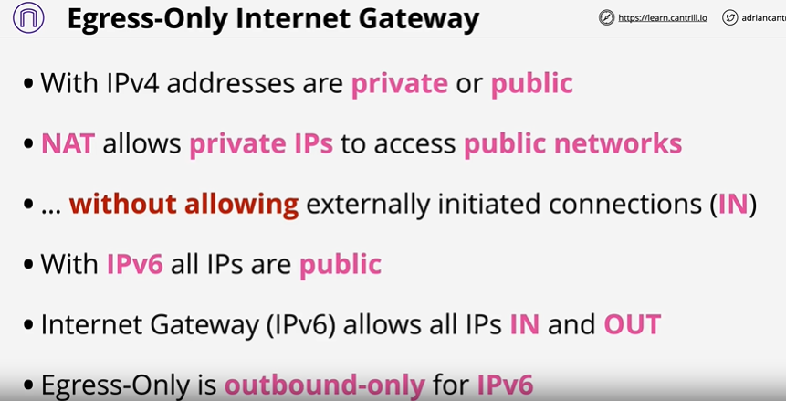
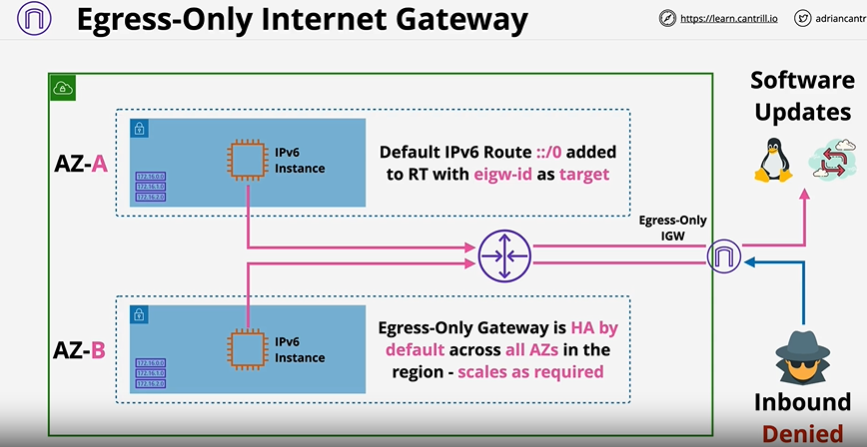
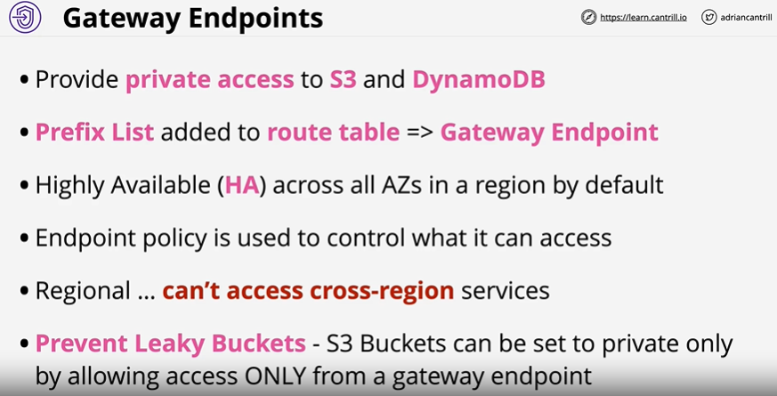
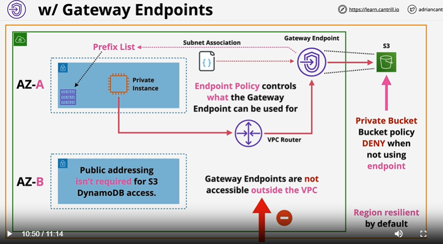
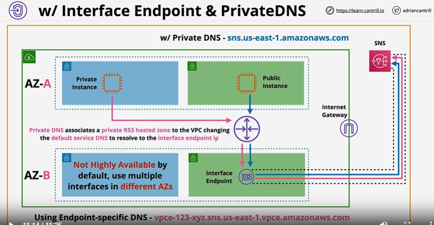
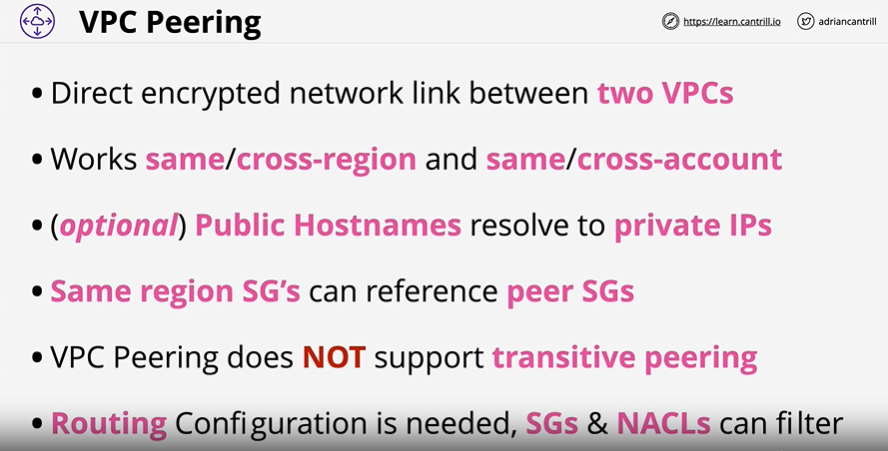
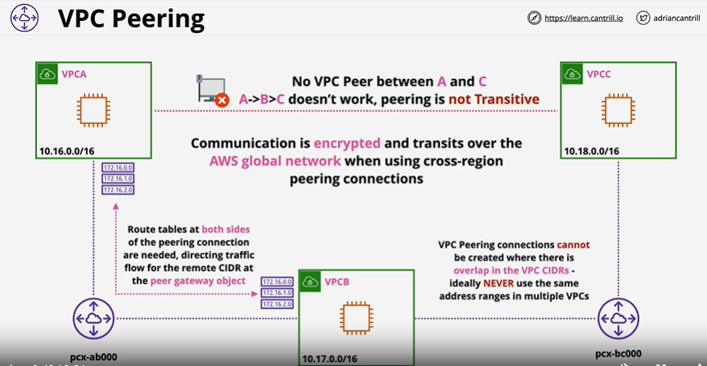

### Egress-Only Internet Gateway

### Gateway-Endpoint

- Not attach to specific subnet but VPC and automatically configure this route on route table for subnets.
- Just can connect from that VPC

### Interface-Endpoint

### VPC-Peering

  
