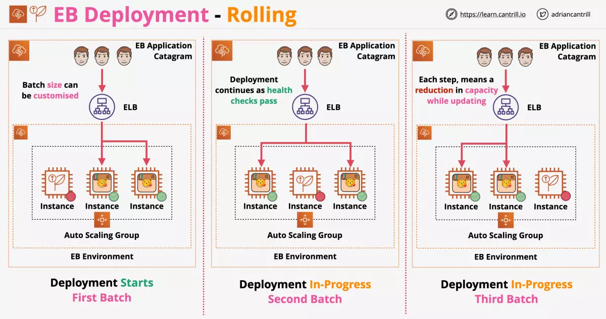
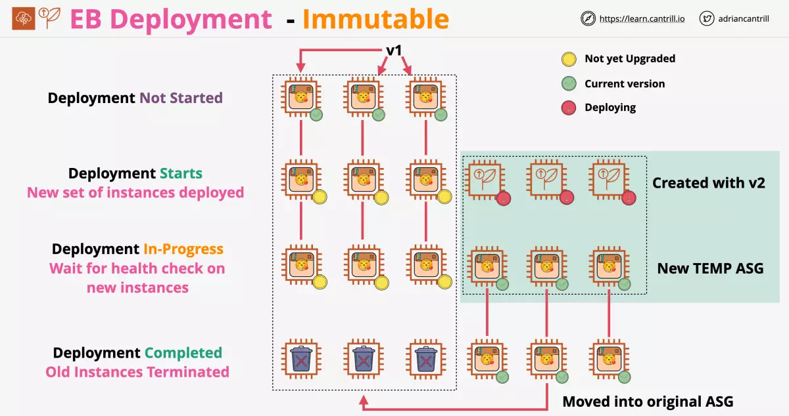
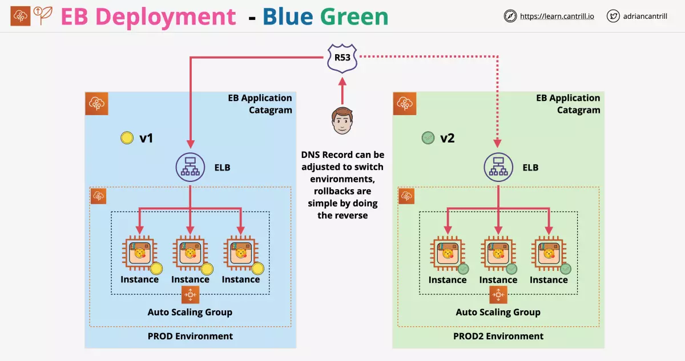

# Elastic Beanstalk (EB)

Elastic Beanstalk is a Platform as a Service environment which can create and manage infrastructure for application code.

- User provides code and EB handles the environment
- EB does create resources behind the scene (you can check for EC2 instances created)
- It also support customization to control how you want the infrastructure
- Any custom defination about the infrastructure can be committed along with the source code

CloudFormation instead is Infrastructure as Code.

- It provides full control over the infrastructure
- But you have to design it, write it and manage it

---

## EB Platforms

- EB supports a list of languages natively
- Docker allows to use any unsupported runtime
- Supports custom platforms

Docker can have

- single containers
- multiple containers if your application uses multiple containers

> Multiple containers are orchestrated using ECS

Preconfigured docker

- These have platforms that are not yet natively supported

Custom platforms can be created using packer

---

## Architecture

```
application

    |
    |
    V

one or more environment

    |
    |
    V

each environment has one or more application versions

    +

each environment has one or more configuration
```

Application Versions

- These are specific labelled version of deployable code for an application
- The source bundle is stored on S3

Environments are containers of infrastructure and configuration for a specific application version

- Here: PROCESSING, PROD, TEST

### Environment Types

Each environment is either

- Web server tier
- Worker tier

### Flow

Both environment web and worker tier has Auto Scaling Groups within them.

- Web server tier accept connections from customers via ELB
- Any work load generated by Web server tier can then be passed into a SQS queue as messages
- The Worker tier receives the messages from the SQS queue

### Scaling

Web Server Tier scales based on the number of request to the ELB.

Worker Tier scales based on the number of messages in the SQS queue.

### Security

Security group for the web server tier will be configured by EB to accept HTTP connections.

Security group for the worker tier will be configured by EB to accept only connections from ELB.

### CNAME

Each environment has its own CNAME.

User can connect to our application using the CNAME or the DNS name.

- CNAME allows swapping two environment DNS
- This swapping is called `blue-green` deployment


---

## Considerations

- It needs application tweaks
- Use docker for anything unsupported
- Great for small development teams
- Databases are generally OUTSIDE of elastic beanstalk
- Databases within the environment are deleted, when environment is deleted

---

## Deployment Policies

### All at once

- deploy all at once, brief outage


### Rolling

- deploy in rolling batches
- you can pick the batch size
- if you have 4 instances, when one instance is being updated, availability takes a 25% hit
- there will be two version running simultaneosly during the update



### Rolling with additional batch

- maintains 100% capacity during the deployment
- there will be two version running simultaneosly during the update


### Immutable

- creates entirely new set of instances
- a temporary autoscaling group is created behind the ELB
- old environment is removed and the autoscaling group is updated
- this is easiest to rollback, as you can commit to new environment only when new environment is tested sucessfully



### Traffic splitting

- its same as immutable deployment
- additionally it allows us to control the split of traffic between the versions
- you can perform AB testing with this before moving completely (pink and blue color )


---

## Blue-Green Deployment

You can also manually switch between environments without using any deployment policy.



---
