# CloudFormation

CloudFormation defines logical resources within templates (using YAML or JSON).

The logical resource defines the WHAT, and leaves the HOW up to the CFN product. A CFN stack creates a physical resource for every logical resource - updating or deleting them as a template changes.

- Templates are used to create Stacks
- Templates can create 1 stack or multiple stacks
- When the stack is created, physical resources are also created based on the logical resources mentioned in the template
- If a stacks template is changed, physical resources are added, updated or deleted
- If a stack is deleted, normally, the physical resources are deleted
- Once a logical resource moves to create_complete i.e. the physical resource is active, it can be referenced within the template [same or other?]

Following is a snippet of the complete CFN template:

```yaml
Resources:
  Instance:
    Type: "AWS:EC2:Instance"
    Properties:
      ImageId: !Ref LatestAmiId
      InstanceType: "t3.micro"
      KeyName: "A4L"
```

Resources `Properties` are used by CFN when creating the matching Physical Resources.

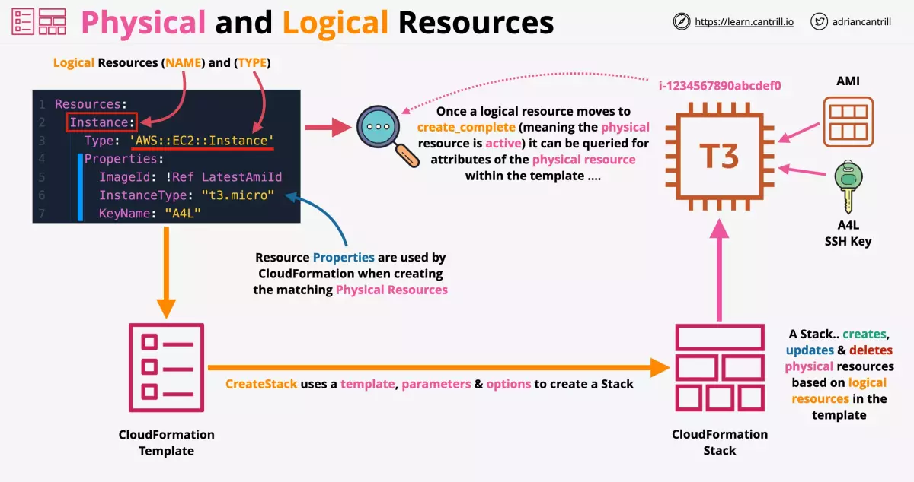

The following template will create an S3 bucket if name is unique across aws and an instance using AMI specified. This is a `non-portable template` and can be used only once (until your usage is preceded by deletion of stack created by last usage) since the bucket name is hardcoded. Also since AMI id is region specific, this template can only be used in one region.

```yaml
Resources:
  Bucket:
    Type: "AWS::S3::Bucket"
    Properties:
      BucketName: "accatpics13333337"
  Instance:
    Type: "AWS::EC2::Instance"
    Properties:
      KeyName: "A4L"
      InstanceType: "t2.micro"
      ImageId: "ami-04d29b6f966df1537"
```

Portable version of the above CFN template is as follows, which requires us to input the AMI id as a parameter:

```yaml
Parameters:
  KeyName:
    Type: "AWS::EC2::KeyPair::KeyName"
    Description: "Key Pair for EC2"
  AMIID:
    Type: "String"
    Description: "AMI for EC2"
Resources:
  Bucket:
    Type: "AWS::S3::Bucket"
  Instance:
    Type: "AWS::EC2::Instance"
    Properties:
      KeyName: !Ref "KeyName"
      InstanceType: "t2.micro"
      ImageId: !Ref "AMIID"
```

To make this even more portable using SSM we can avoid specifying the Key related details. Also, this uses portable version of AMI referencing which fetches the correct AMI id from the SSM parameter store in each region:

```yaml
Parameters:
  LatestAmiId:
    Description: "AMI for EC2"
    Type: "AWS::SSM::Parameter::Value<AWS::EC2::Image::Id>"
    Default: "/aws/service/ami-amazon-linux-latest/amzn2-ami-hvm-x86_64-gp2"
Resources:
  Bucket:
    Type: "AWS::S3::Bucket"
  Instance:
    Type: "AWS::EC2::Instance"
    Properties:
      InstanceType: "t2.micro"
      ImageId: !Ref "LatestAmiId"
```

---

## Template and Pseudo Parameters

```yaml
Parameters: set of parameters

Resources: set of resources
```

Template and Pseudo Parameters allow input into CloudFormation. They allow input from console, CLI or API.


Pseudo parameters are parameters that are predefined by AWS CloudFormation. You don't declare them in your template. Use them the same way as you would a parameter, as the argument for the Ref function.

```yaml
Outputs:
  MyStacksRegion:
    Value: !Ref "AWS::Region"
```

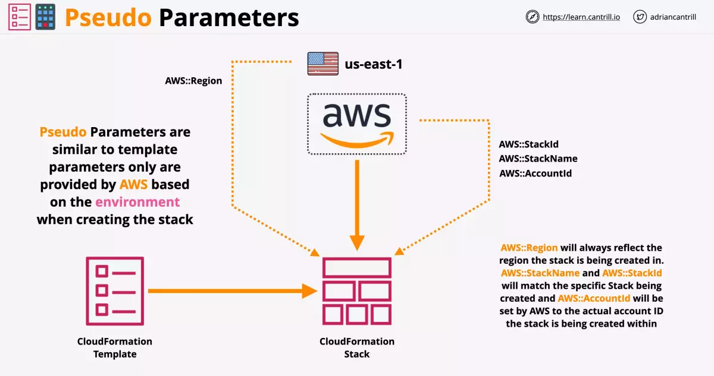

Following is the list of Pseudo Parameters that are available:

- AWS::AccountId
- AWS::NotificationARNs
- AWS::NoValue
- AWS::Partition
- AWS::Region
- AWS::StackId
- AWS::StackName
- AWS::URLSuffix

---

## Intrinsic Functions

Use intrinsic functions in your templates to assign values to properties that are not available until runtime.

You can use intrinsic functions only in specific parts of a template. Currently, you can use intrinsic functions in `resource properties`, `outputs`, `metadata attributes`, and `update policy attributes`. You can also use intrinsic functions to conditionally create stack resources.

Following are the list of built-in functions:

Reference a value from other one

- Ref
- Fn::GetAtt


Join or split strings

- Fn::Join
- Fn::Split

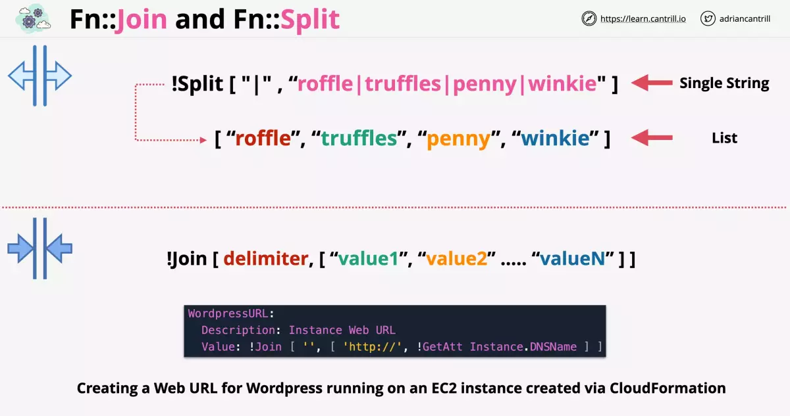

Get list of AZs and Select one from the list

    If you have badly configured VPC (say default VPC where you have deleted subnets), then GetAZs might not return all the AZ's.

- Fn::GetAZs
- Fn::Select

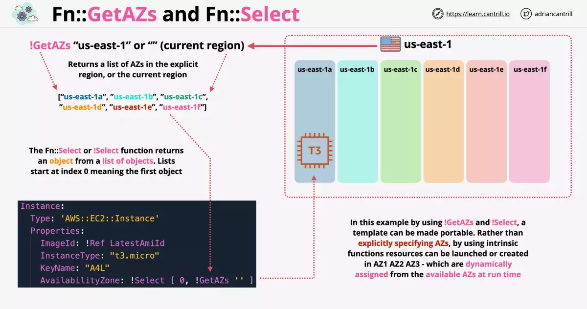

Provision resources based on conditional check

- Condition functions (Fn::IF, And, Equals, Not & Or)

Encode data such as user data and Substitute information based on runtime information

    Self references is invalid with Sub function. As we cannot pass the reference of the EC2 instance before its created.

- Fn::Base64
- Fn::Sub

Sub function can be passed:

- Parameter value
- Logical Resource name or id
- Logical Resource attribute name


Build CIDR block for networking by automatically building subnet ranges

- Fn::Cidr

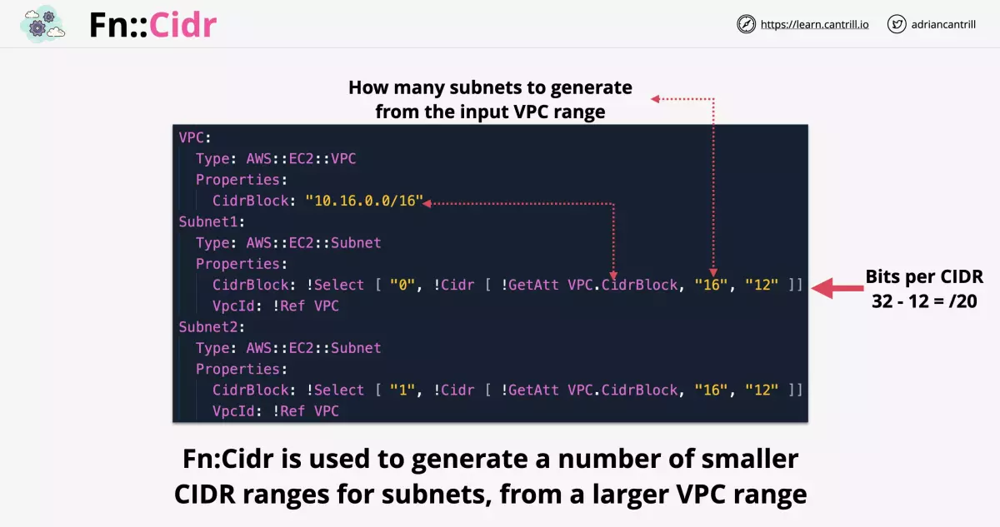

Others

- Fn::ImportValue
- Fn::FindInMap
- Fn::Transform

---

## CloudFormation Mappings

```yaml
Parameters: set of parameters

Mappings: use to specify conditional parameter values

Resources: set of resources
```

Following is an example of finding a suitable AMI based on the lookup table provided.

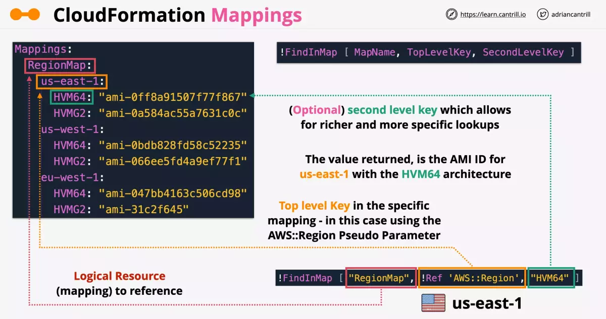

---

## CloudFormation Outputs

```yaml
Outputs:
  - Describes the values that are returned whenever you view your stack's properties. Say, while using "aws cloudformation describe-stacks" AWS CLI command
```

The optional Outputs section declares output values that you can import into other stacks (to `create cross-stack references`), return in response (to describe stack calls), or view on the AWS CloudFormation console.


---

## CloudFormation Conditions

```yaml
Parameters: set of parameters

Mappings: set of mappings

Resources: set of resources

Conditions:
  - Conditions that control whether certain resources are created
  - or whether certain resource properties are assigned a value during stack creation or update.
  - For example, you could conditionally create a resource that depends on whether the stack is for a production or test environment.
```

Conditions are evaluated before any logical resource creation starts. It can be used to decide whether certain resource should be created or not.


---

## CloudFormation DependsOn

CloudFormation decides the order based on which resource references other resource. But to explicitly define the dependency you can use DependsOn attribute.

When you add a DependsOn attribute to a resource, that resource is created only after the creation of the resource specified in theDependsOn attribute.

Consider the following example where we are creating an VPC and an Internet Gateway.

- A VPC can be created without creating Internet Gateway first
- An Internet Gateway can be created without creating an VPC first
- But an Internet Gateway Attachment which connect both VPC and Internet Gateway, will have to wait until both of them are created first. So, this will implicitly depend on a VPC and Internet Gateway

For an elastic IP to successfully be configured through CFN

- It needs to be attached only after an Internet Gateway Attachment is created
- It needs to be deleted before an Internet Gateway Attachment is deleted

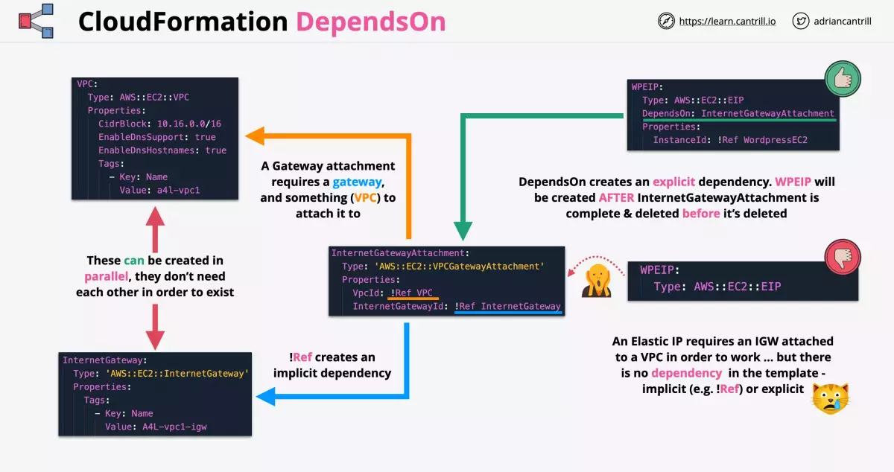

---

## CloudFormation CreationPolicy, WaitConditions and cfn-signal

Consider an EC2 instance that bootstraps itself using the user data specified. When this EC2 instance is created through CFN, the EC2 instance creation will succeed long before the bootstraping completes. And even when the bootstraping completes, there is no way to tell CFN that the bootstrap was successful or failed.

CreationPolicy, WaitConditions and cfn-signal can all be used in such case to let CFN know that the bootstraping was success or not.

### CloudFormation Signal

- Configure CFN to hold and wait for given number of signals or wait for a timeout to expire (12 hours max)
- So, in this case the logical resource EC2 will not reach the CREATE_COMPLETE state
- If the number of signals required are received, CFN will go to CREATE_COMPLETE (that means the bootstraping was successful)
- If there is any failure, CFN will go to FAILURE and the stack creation will fail
- If the timeout is reached, CFN will go to FAILURE and the stack creation will fail

To send success or failure signals, we use a utility `cfn-signal` running on the EC2 instance.

### Creation Policy

Associate the CreationPolicy attribute with a resource to prevent its status from reaching create complete until AWS CloudFormation receives a specified number of success signals or the timeout period is exceeded.

To signal creation of EC2 or Auto Scaling Groups, you should use CreationPolicy.

- A CreationPolicy is specifically tied to that resource.

In the following example:

- AutoScalingGroup is waiting for 3 signal
- Each EC2 instance will send a signal using `cfn-signal`


### Wait Conditions

Just like CreationPolicy, this allows resource creation to be paused until timeout or signal is received.

WaitCondition can depend on other resources. And other resources can depend of WaitCondition.

- It can be used a progress gate. So that checks cannot be passed until that signals are received.
- WaitCondition will not proceed to CREATE_COMPLETE until the timeout or signal is received.

**WaitCondition relies on WaitHandle**, which `generates a presigned URL to send signal`.

- Since its presigned, no credentials are required to use it.

Consider you have an EC2 instance or say an external system that is used for licencing.

- They send a JSON response as a signal containing few attributes which can then be referenced else where.
- The attribute of the signal can be accessed using `Fn::GetAtt` function


---

## CloudFormation Nested Stacks

A CFN Stack is isolated, which means it contains all of the AWS resources that the project needs.

Resources in a single stack `share a lifecycle`. In an isolated stack the resources are created together, updated together and deleted together.

- Designing CFN stack this way is fine until you hit the limits.
- There is limit of 500 resources per stack.
- Also, you can't easily reference resources.
- Also, you can't easily reference other stacks.

For complex projects, you are recommended to use Nested Stacks or Cross-Stack references.

### About Nested Stacks

For nested stacks you start with a Root Stack and Parent Stack. In the following example the Root Stack and the Parent Stack are the same.

`Root Stack` is the stack that gets created first.

`Parent Stack` is the parent of the stack that it immediately creates. That is anything that has its own nested stack.

    You can only use `Outputs` with nested stack. You can directly reference the logical resources created in any of the nested stacks.

The `Root Stack` can take the `Outputs` from one nested stack (VPCSTACK) and pass it as parameters to another (ADSTACK).

- Root Stack orchestrates the creation of nested stacks.

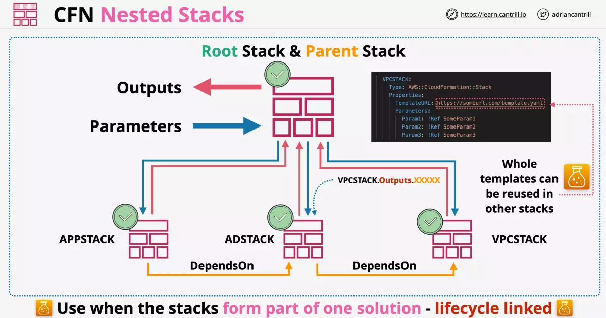

- Once the logical resource in the nested stack are created its marked as `CREATE_COMPLTE`. Once all the nested stacks within a Root Stack are created it is also marked as `CREATE_COMPLETE`.

- The advantage of using nested stack is that the for each nested template can be reused in other stacks.

  - In doing so, you are reusing the CloudFormation template code but not the actual resources created by the reuse of the template.
  - This is unlike what happens with the usage of Cross-Stack reference.

- Nested Stacks are usedful when you want to create resources that are `all part of one solution` and are `lifecycle linked`.

### When not to use nested stack

When you need one portion of the stack to stay longer than the other, nested stack is not the ideal choice.

In such case, Cross-Stack reference are better suited.

---

## CloudFormation Cross-Stack Reference

CloudFormation Stacks are designed to be isolated and self-contained.

- Outputs are normally not visible from other stacks
- Nested stacks can reference them

Outputs though can be exported, making them visible from other stacks.

- exports must have a unique name in the region
- We use `Ref` function to reference resource in the same stack
- We use `Fn::ImportValue` instead of Ref to use exports of one stack into another

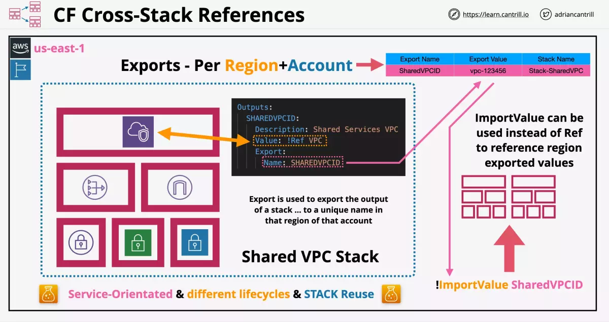

    Cross region or Cross account usage of exports doesnt work.

### difference between cross-stack and nested-stack

- Cross stack allows us to reuse resources
- Nested stack allows us to reuse templates

---

## CloudFormation Stack Sets

StackSets are a feature of CloudFormation allowing infrastructure to be deployed and managed across multiple regions and multiple accounts from a single location.

- This can be done without having to change account, pass credentials for each or change regions.

StackSets act as containers, in an admin account.

- These containers contains many stack instances
- Stack instances are reference to stack in a single region, in a single account
- Stack instances and stack are created in a `target account` (just another aws account that is a target for the stack set to do the deployment)

To manage cross accout and cross region access StackSets use either:

- Self Managed Role
- Service Managed Role

With `Service Managed Role` you use CloudFormation in conjuction with AWS Organisation, so all the roles gets created on our behalf.

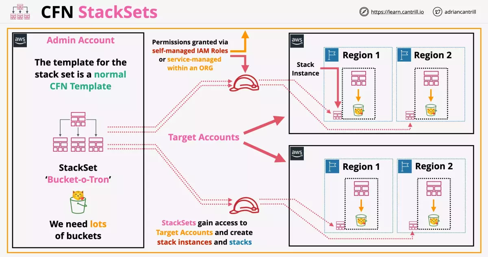

### Terms

**Concurrent Accounts** - This value decides how many account we should be be deploying in simulatanously.

**Failure Tolerance** - This value indicates how many individual deployments can fail until the whole StackSet is considered a failure

**Retain Stacks** - By default the stacks will be removed, but this option allows us to retain them.

### Use Cases

- To enable AWS Config across a large range of accounts
- To set AWS Config Rules for MFA, EIPS (Elastic IPs), EBS Encryption
- To create IAM roles for cross-account access at scale

---

## CloudFormation Deletion Policy

With the DeletionPolicy attribute you can preserve or (in some cases) backup a resource when its stack is deleted.

- If a resource has no DeletionPolicy attribute, AWS CloudFormation deletes the resource by default.

You specify a DeletionPolicy attribute for each resource that you want to control. Possible option are:

- Delete (default)
- Retain
- Snapshot (Applicable to EBS, ElastiCache, Neptune, RDS, Redshit)

So, say you have an EC2 instance with an attached EBS volume created using CFN. With Snapshot option the data on the EBS volume will be copied to a snapshot.

- Post cleanup of the stack the resources will be deleted but the snapshot will remain.


### Consideration

- If you remove a logical resource from the template, the deletion policy applies
- If you just update a logical resource from the template, the deletion policy doesnt apply
  - The resource in such case will be deleted and recreated
  - Any data on the resource will be lost

---

## CloudFormation Stack Roles

CloudFormation Stack Roles is used to control `what identities (say Phil) with lesser permissions can do using CFN`, allowing to achive role seperation.

While using CFN to create stack that creates physical resources, permission for actions on stack and those physical resources is needed.

- CFN uses the permissions of the logged in identity
- Admin team can create, update and delete AWS `resources`
- Then Phil only needs permission for creating, updating and deleting the `stack` and the `PassRole` permission

Phil can take the CFN template created by the admin team and use it to create the stack.

- Also, admin team creates an IAM role that can only be passed by Phil, but cannot be assumed
- PassRole is used by identities to pass this into CFN
- This means that role is attached to the stack and used for any operations `rather than using the identities permission`

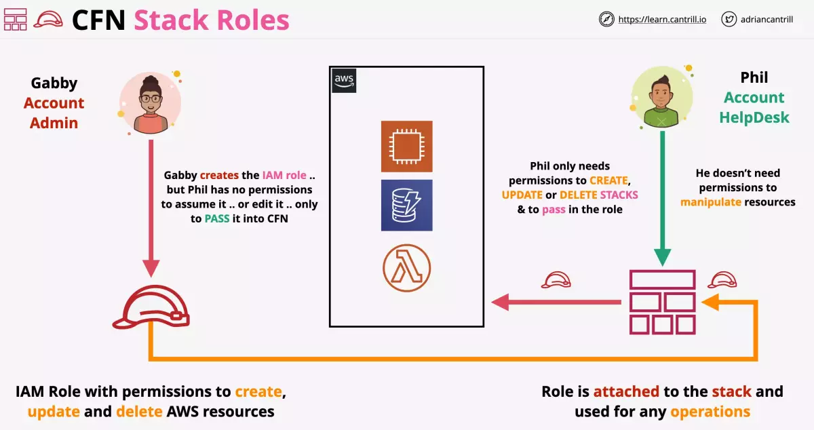

---

## CloudFormation Init (cfn-init)

For the CloudFormation if you use the `AWS::CloudFormation::Init` type to include `metadata` on an Amazon EC2 instance for the `cfn-init` helper script.

- userdata defines a script of how to do changes in the system
- cfn-init defines what state the system needs to be in

Also, cfn-init is idempotent.

- So, say you want to install a service through cfn-init and its alredy present, it wont install it again.
- Or say a service needs to be started and its already running, then cfn-init wont perform any action.

### AWS::CloudFormation::Init

The configuration for `cfn-init` is stored in the template under `Metadata - AWS::CloudFormation::Init`.

- `cfn-init` is executed through UserData. it uses the configuration that we have defined under `Metadata - AWS::CloudFormation::Init`.
- also here we are using cfn-signal to indicate that the bootstraping is complete.

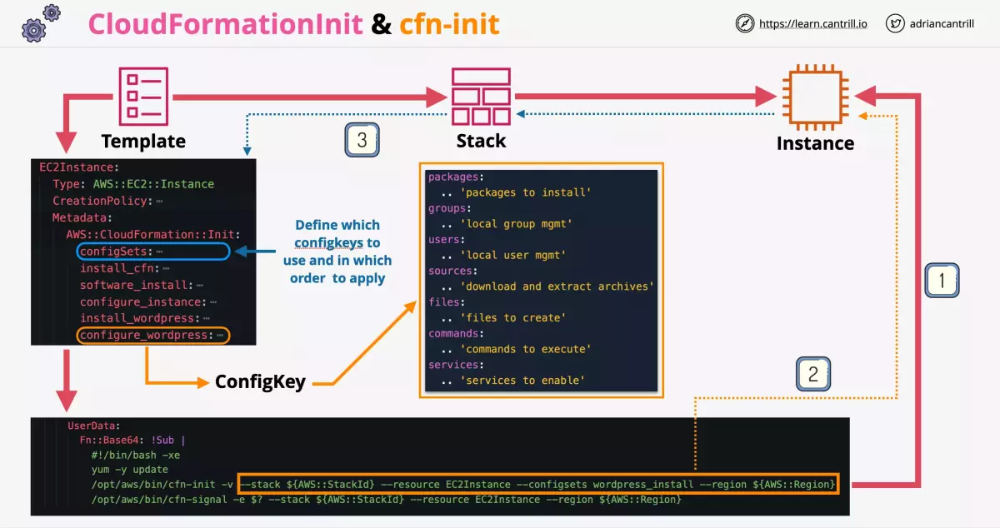

### Steps [incomplete - add about ConfigKeys]

- Template is used to create the stack which creates an EC2 instance.
- cfn-init is executed by the instance, along with other content in the UserData section.
- variables used within cfn-init are replaced before UserData is passed to EC2 instance
- cfn-init communicates with CFN to get the configuration

  If you update the configuration in `Metadata - AWS::CloudFormation::Init` and rerun the template, cfn-init isn't reapplied.

---

## CloudFormation cfn-hup

`cfn-init` is run only once as part of bootstraping (user data). If `AWS::CloudFormation::Init` is updated, cfn-init isnt rerun during the UpdateStack API action.

`cfn-hup` helper is a daemon that detects changes in resource metadata and runs user-specified actions when a change is detected.

- This allows you to make configuration updates on your running Amazon EC2 instances through the UpdateStack API action.

### Steps

- A template's init configuration is changed
- Post the change UpdateStack API action is called upon the stack to perform the stack update
- cfn-hup running on the instance, detects the change configuration
- For the change to be applied, cfn-hub calls cfn-init which uses the new configuration.

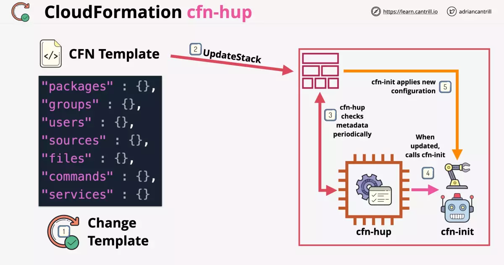

---

## CloudFormation ChangeSets

Change sets allow you to preview how proposed changes to a stack might impact your running resources, for example, whether your changes will delete or replace any critical resources.

- As part of the change set, you can review the changes that are gonna happen under the `JSON changes` section of the `Change Set`.
- Only when you execute your changes the stack is updated
- You can have multiple change sets at the same time. You can either select any one of them to be executed or delete any of the change set.

---

## CloudFormation Custom Resources

Custom resources enable you to write custom provisioning logic in templates that AWS CloudFormation runs anytime you create, update (if you changed the custom resource), or delete stacks.

    Custom resources can be idenfified in the template using `Type: "Custom:<resource-name>`.

- CFN doesnt support everything
- Custom Resources let CFN integrate with anything it doesn't yet or doesnt natively support

```yaml
Resources:
  copyanimalpics:
    Type: "Custom::S3Objects"
    Properties:
      ServiceToken: !GetAtt CopyS3ObjectsFunction.Arn
      SourceBucket: "cl-randomstuffforlessons"
      SourcePrefix: "customresource"
      Bucket: !Ref animalpics
```

Note the implicit dependencies (eg. CopyS3ObjectsFunction.Arn and animalpics) in the template unlike what we specify using `DependsOn`.

### How Custom Resources Work

CFN begins the process of creating the custom resource by sending data to an endpoint that is defined by the user within the custom resource. This can be a `lambda function` or an `SNS topic`.

Whenever a custom resource is created, updated or deleted, then CFN sends data to that custom resource in the form of event data.

- Event data contains the details of operations that are happening with the custom resource
- Lambda function is invoked with this data. Lambda then responds back with the data about that can be used by other resources in CFN.

### Use Case

Consider for example if you try to delete a bucket created with CFN containing object, it will not delete the bucket and result into an error.

Or you can use Custom Resources to provision non-aws resources.

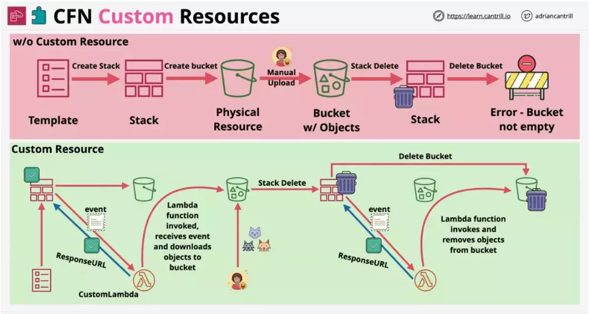

In the example above, when you create a bucket using custom resource

- the stack will create an empty bucket and notify the lambda with an event about the bucket creation
- CustomLambda function will upload the objects that are required into the bucket and signal CFN that its done.
- This will move the stack into CREATE_COMPLETE state
- So, even if objects into the bucket are loaded externally, the stack will not be impacted.
- When a delete stack operation happens in this case, instead of attempting to delete the bucket first, CFN will follow the reverse order of the creation.
- So CFN will attempt to delete the Custom Resource i.e. CustomLambda function by sending it a event
- Using the event data lambda will perform operations on the bucket, which here means clearing the bucket content
- Once done it will signal CFN about completion
- CFN will now proceed to deleting the bucket successfully

---

## Misc

### CLI

The `aws cloudformation package` command packages the local artifacts (local paths) that your AWS CloudFormation template references. The command uploads local artifacts, such as source code for an AWS Lambda function or a Swagger file for an AWS API Gateway REST API, to an S3 bucket. The command returns a copy of your template, replacing references to local artifacts with the S3 location where the command uploaded the artifacts.

`aws cloudformation validate-template` command will just check the template if it is a valid JSON or YAML file.

`aws cloudformation deploy` command uses S3 as the location for artifacts that were defined in the Cloudformation template.

`aws cloudformation update-stack` command is used to update the stack.

---

# Demo

## 1. UserData

```yaml
Parameters:
  LatestAmiId:
    Description: "AMI for EC2"
    Type: "AWS::SSM::Parameter::Value<AWS::EC2::Image::Id>"
    Default: "/aws/service/ami-amazon-linux-latest/amzn2-ami-hvm-x86_64-gp2"
  Message:
    Description: "Message for HTML page"
    Default: "Cats are the best"
    Type: "String"
Resources:
  InstanceSecurityGroup:
    Type: "AWS::EC2::SecurityGroup"
    Properties:
      GroupDescription: Enable SSH and HTTP access via port 22 IPv4 & port 80 IPv4
      SecurityGroupIngress:
        - Description: "Allow SSH IPv4 IN"
          IpProtocol: tcp
          FromPort: "22"
          ToPort: "22"
          CidrIp: "0.0.0.0/0"
        - Description: "Allow HTTP IPv4 IN"
          IpProtocol: tcp
          FromPort: "80"
          ToPort: "80"
          CidrIp: "0.0.0.0/0"
  Bucket:
    Type: "AWS::S3::Bucket"
  Instance:
    Type: "AWS::EC2::Instance"
    Properties:
      InstanceType: "t2.micro"
      ImageId: !Ref "LatestAmiId"
      SecurityGroupIds:
        - !Ref InstanceSecurityGroup
      Tags:
        - Key: Name
          Value: A4L-UserData Test
      UserData:
        Fn::Base64: !Sub |
          #!/bin/bash -xe
          yum -y update
          yum -y upgrade
          # simulate some other processes here
          sleep 300
          # Continue
          yum install -y httpd
          systemctl enable httpd
          systemctl start httpd
          echo "<html><head><title>Amazing test page</title></head><body><h1><center>${Message}</center></h1></body></html>"     /var/www/html/index.html
```

If you re-run the stack template with a different parameter values which essentially will change the UserData (if its referring to the parameter), any instances created will be stopped and restarted. This update is called `Update With Disruption`.

- But the `UserData` section will not be rerun, as UserData is applied one once when the instance is launched for the first time.
- This is because the instance configuration is not updated when the stack is updated.

  ${Message} will not be updated during rerun of the stack template, until you delete the stack and create a new one.

---

## 2. Userdata + cfn-signal

```yaml
Parameters:
  LatestAmiId:
    Description: "AMI for EC2"
    Type: "AWS::SSM::Parameter::Value<AWS::EC2::Image::Id>"
    Default: "/aws/service/ami-amazon-linux-latest/amzn2-ami-hvm-x86_64-gp2"
  Message:
    Description: "Message for HTML page"
    Default: "Cats are the best"
    Type: "String"
Resources:
  InstanceSecurityGroup:
    Type: "AWS::EC2::SecurityGroup"
    Properties:
      GroupDescription: Enable SSH and HTTP access via port 22 IPv4 & port 80 IPv4
      SecurityGroupIngress:
        - Description: "Allow SSH IPv4 IN"
          IpProtocol: tcp
          FromPort: "22"
          ToPort: "22"
          CidrIp: "0.0.0.0/0"
        - Description: "Allow HTTP IPv4 IN"
          IpProtocol: tcp
          FromPort: "80"
          ToPort: "80"
          CidrIp: "0.0.0.0/0"
  Bucket:
    Type: "AWS::S3::Bucket"
  Instance:
    Type: "AWS::EC2::Instance"
    CreationPolicy:
      ResourceSignal:
        Timeout: PT15M
    Properties:
      InstanceType: "t2.micro"
      ImageId: !Ref "LatestAmiId"
      SecurityGroupIds:
        - !Ref InstanceSecurityGroup
      Tags:
        - Key: Name
          Value: A4L-UserData Test
      UserData:
        Fn::Base64: !Sub |
          #!/bin/bash -xe
          yum -y update
          yum -y upgrade
          # simulate some other processes here
          sleep 300
          # Continue
          yum install -y httpd
          systemctl enable httpd
          systemctl start httpd
          echo "<html><head><title>Amazing test page</title></head><body><h1><center>${Message}</center></h1></body></html>"     /var/www/html/index.html
          /opt/aws/bin/cfn-signal -e $? --stack ${AWS::StackId} --resource Instance --region ${AWS::Region}
```

Notice the `cfn-signal` command at the end of `UserData`. Once the bootstrapping is complete. This command will run and notifies CFN the end of bootstrapping process.

- In this case the Instance will not move into `CREATE_COMPLETE` state until the signal is received.

### log files

Under "/var/log"

- `cloud-init-output.log` - contains all the commands that are run in the UserData component as part the bootstraping process and **their outputs**

  ${Message} will not be updated during rerun of the stack template, until you delete the stack and create a new one.

---

## 3. cfn-init + cfn-signal

```yaml
Parameters:
  LatestAmiId:
    Description: "AMI for EC2"
    Type: "AWS::SSM::Parameter::Value<AWS::EC2::Image::Id>"
    Default: "/aws/service/ami-amazon-linux-latest/amzn2-ami-hvm-x86_64-gp2"
  Message:
    Description: "Message for HTML page"
    Default: "Cats are the best"
    Type: "String"
Resources:
  InstanceSecurityGroup:
    Type: "AWS::EC2::SecurityGroup"
    Properties:
      GroupDescription: Enable SSH and HTTP access via port 22 IPv4 & port 80 IPv4
      SecurityGroupIngress:
        - Description: "Allow SSH IPv4 IN"
          IpProtocol: tcp
          FromPort: "22"
          ToPort: "22"
          CidrIp: "0.0.0.0/0"
        - Description: "Allow HTTP IPv4 IN"
          IpProtocol: tcp
          FromPort: "80"
          ToPort: "80"
          CidrIp: "0.0.0.0/0"
  Bucket:
    Type: "AWS::S3::Bucket"
  Instance:
    Type: "AWS::EC2::Instance"
    Metadata:
      "AWS::CloudFormation::Init":
        config:
          packages:
            yum:
              httpd: []
          files:
            /var/www/html/index.html:
              content: !Sub |
                <html><head><title>Amazing test page</title></head><body><h1><center>${Message}</center></h1></body></html>
          commands:
            simulatebootstrap:
              command: "sleep 300"
          services:
            sysvinit:
              httpd:
                enabled: "true"
                ensureRunning: "true"
                files:
                  - "/var/www/html/index.html"
    CreationPolicy:
      ResourceSignal:
        Timeout: PT15M
    Properties:
      InstanceType: "t2.micro"
      ImageId: !Ref "LatestAmiId"
      SecurityGroupIds:
        - !Ref InstanceSecurityGroup
      Tags:
        - Key: Name
          Value: A4L-UserData Test
      UserData:
        Fn::Base64: !Sub |
          #!/bin/bash -xe
          /opt/aws/bin/cfn-init -v --stack ${AWS::StackId} --resource Instance --region ${AWS::Region}
          /opt/aws/bin/cfn-signal -e $? --stack ${AWS::StackId} --resource Instance --region ${AWS::Region}
```

Here the `cfn-init` will use the **config directive** under `AWS::CloudFormation::Init` to reach the desired state:

```sh
cfn-init -v --stack ${AWS::StackId} --resource Instance --region ${AWS::Region}
```

### log files

Under "/var/log"

- `cloud-init-output.log` - contains all the commands that are run in the UserData component as part the bootstraping process without details
- `cfn-init-cmd.log` - contains the overview of cfn-init command and its execution
- `cfn-init.log` - contains the detailed breakdown of cfn-init command and its execution

  ${Message} will not be updated during rerun of the stack template, until you delete the stack and create a new one.

---

## 4. cfn-init + cfn-signal + cfn-hup

```yaml
Parameters:
  LatestAmiId:
    Description: "AMI for EC2"
    Type: "AWS::SSM::Parameter::Value<AWS::EC2::Image::Id>"
    Default: "/aws/service/ami-amazon-linux-latest/amzn2-ami-hvm-x86_64-gp2"
  Message:
    Description: "Message for HTML page"
    Default: "Cats are the best"
    Type: "String"
Resources:
  InstanceSecurityGroup:
    Type: "AWS::EC2::SecurityGroup"
    Properties:
      GroupDescription: Enable SSH and HTTP access via port 22 IPv4 & port 80 IPv4
      SecurityGroupIngress:
        - Description: "Allow SSH IPv4 IN"
          IpProtocol: tcp
          FromPort: "22"
          ToPort: "22"
          CidrIp: "0.0.0.0/0"
        - Description: "Allow HTTP IPv4 IN"
          IpProtocol: tcp
          FromPort: "80"
          ToPort: "80"
          CidrIp: "0.0.0.0/0"
  Bucket:
    Type: "AWS::S3::Bucket"
  Instance:
    Type: "AWS::EC2::Instance"
    Metadata:
      "AWS::CloudFormation::Init":
        config:
          packages:
            yum:
              httpd: []
          files:
            /etc/cfn/cfn-hup.conf:
              content: !Sub |
                [main]
                stack=${AWS::StackName}
                region=${AWS::Region}
                interval=1
                verbose=true
              mode: "000400"
              owner: "root"
              group: "root"
            /etc/cfn/hooks.d/cfn-auto-reloader.conf:
              content: !Sub |
                [cfn-auto-reloader-hook]
                triggers=post.update
                path=Resources.Instance.Metadata.AWS::CloudFormation::Init
                action=/opt/aws/bin/cfn-init -v --stack ${AWS::StackId} --resource Instance --region ${AWS::Region}
                runas=root
              mode: "000400"
              owner: "root"
              group: "root"
            /var/www/html/index.html:
              content: !Sub |
                <html><head><title>Amazing test page</title></head><body><h1><center>${Message}</center></h1></body></html>
          commands:
            simulatebootstrap:
              command: "sleep 300"
          services:
            sysvinit:
              cfn-hup:
                enabled: "true"
                ensureRunning: "true"
                files:
                  - /etc/cfn/cfn-hup.conf
                  - /etc/cfn/hooks.d/cfn-auto-reloader.conf
              httpd:
                enabled: "true"
                ensureRunning: "true"
                files:
                  - "/var/www/html/index.html"
    CreationPolicy:
      ResourceSignal:
        Timeout: PT15M
    Properties:
      InstanceType: "t2.micro"
      ImageId: !Ref "LatestAmiId"
      SecurityGroupIds:
        - !Ref InstanceSecurityGroup
      Tags:
        - Key: Name
          Value: A4L-UserData Test
      UserData:
        Fn::Base64: !Sub |
          #!/bin/bash -xe
          /opt/aws/bin/cfn-init -v --stack ${AWS::StackId} --resource Instance --region ${AWS::Region}
          /opt/aws/bin/cfn-signal -e $? --stack ${AWS::StackId} --resource Instance --region ${AWS::Region}
```

If we run this template to create the stack for the first time, cfn-hub will start to monitor for change in `AWS::CloudFormation::Init`.

- This change will include any change in parameter, that is referenced within `AWS::CloudFormation::Init` section.

So, once we rerun the stack creation after updating the parameter `Message`, cfn-hub will detect this change and re-run `cfn-init` eventually updating the file `index.html` will references `Message` parameter.
