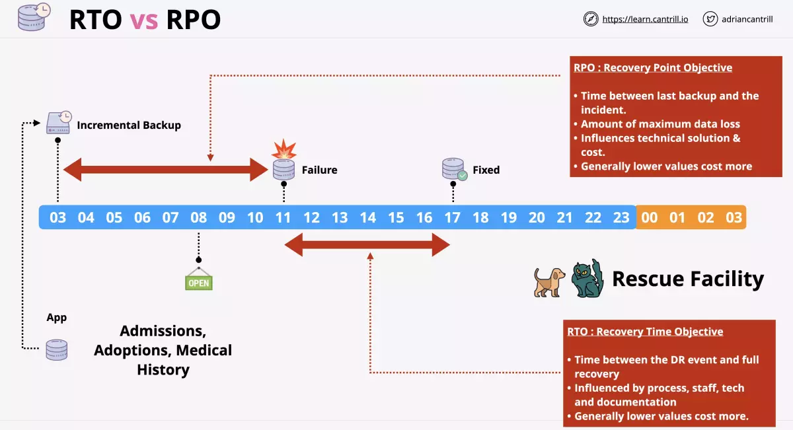
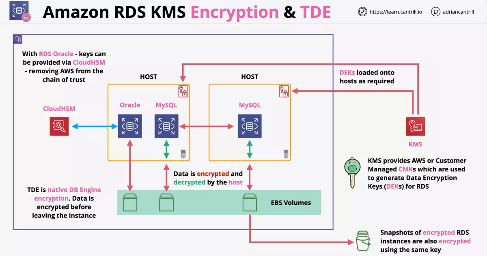
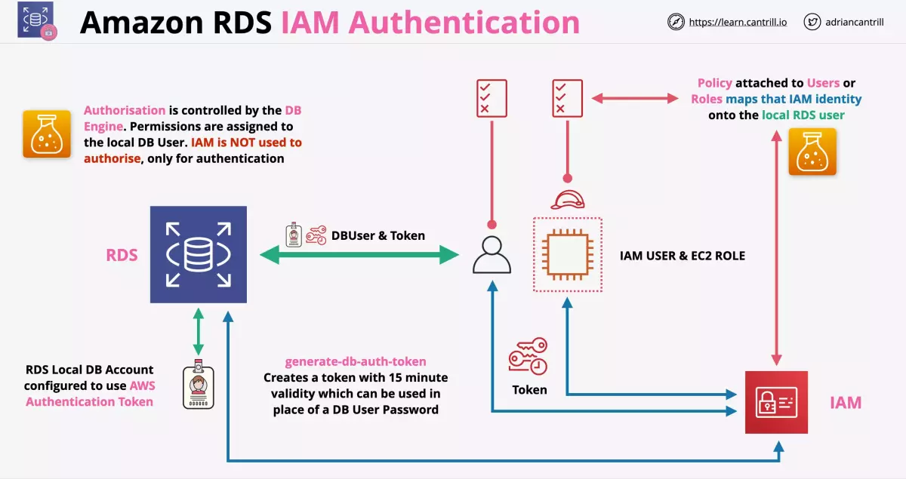
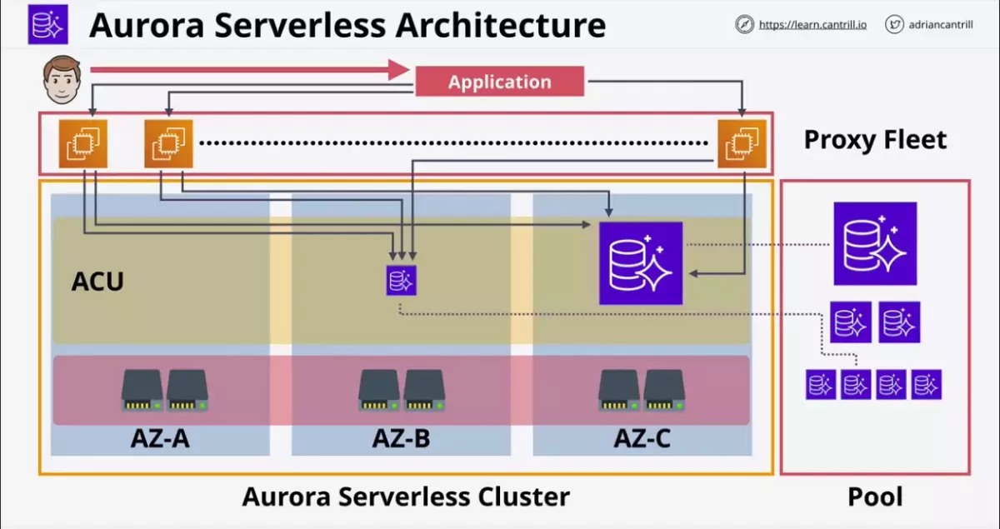

# Database Refresher

https://learn.cantrill.io/courses/1101194/lectures/27894829

Row Store (MySQL) can be used to get list of rows.

These rows can then be moved to Column Store (Redshift) for processing.

Without Graph database a similar data fetch from SQL database would require lots of complex query processing for each request.

## Databases on EC2

When to use:

- When you want particular version of DB
- When you want certain combination of OS and DB

---

# Relational Database Service (RDS)

Database-as-a-service (DBaaS) - not entirely true, more of DatabaseServer-as-a-service. Managed Database Instance for one or more databases

Multiple engines to choose from:

- MySQL
- MariaDB
- PostgreSQL
- Oracle
- Microsoft SQL

Amazon Aurora: Though part of RDS products, but is so different from normal RDS, it is a seperate product.

## RDS Database Instance

Runs one of a few types of database engines and can contain multiple user created databases. Create one when you provision the instance, but multiple can be created after.

Database connects with a CNAME. RDS uses standard database engines.

The database can be optimized for:

- db.m5 general
- db.r5 memory
- db.t3 burst

There is an associated size and AZ selected.

When you provision an instance, you provision storage that is dedicated to that instance. This is EBS storage located in the same AZ. RDS is vulnerable to failures in that AZ.

The storage can be allocated with SSD or magnetic similar to EC2 EBS storage options.

io1 - high IO  
gp2 - same burst pool  
magnetic - compatibility

Billing is per instance and hourly rate for that compute. You are billed for storage allocated.

---

## RDS Multi AZ (High-Availability)

When you provision a Multi-AZ DB Instance, Amazon RDS automatically creates a `primary DB Instance` and `synchronously` replicates the data to a `standby instance` in a `different Availability Zone (AZ)`.

- Each AZ runs on its own physically distinct, independent infrastructure.

RDS Access ONLY via database CNAME. The standby replica cannot be accesed directly unless a failure occurs.

    The CNAME will point at the primary instance.

> Its a standby replica, not a read replica

If any error occurs with the primary database, AWS detects this and will failover within 60 to 120 seconds to change to the new database.

    During failover CNAME will be updated to point to standby replica

### Subnet Groups

.... used to create grouping of subnets that the RDS will be using

### Security Groups

....

### Syncronous Replication

**Syncronous Replication** is a keyword:

1. Database writes happen
2. Primary database instance commits changes
3. Same time as the write is happening, standby replication is happening
4. Standby replica commits writes.

This does not provide fault tolerance - there will be some impact during change

### Considerations

- Multi-AZ feature is not free tier, extra infrastructure for standby. Generally two times the price.
- The standby replica cannot be accesed directly unless a failure occurs.
- Failover is highly available, not fault tolerant.
- Standby replica is in the same region only (other AZ in the VPC).
- Backups taken from standby (removes performance impacts).
- Standby replica will be used during AZ outage, primary failure, manual failover, instance type change, and software patching

---

## RDS Backup and Restores

### RDS Backups

Types of Backups

- Automatic Backups
- Manual Snapshots

`Both type of backup use AWS managed S3 Buckets`.

- The buckets will not be visible in the AWS mgmt console
- As S3's data is replicated across regions, `RDS data becomes region resiliant`
- For single-az, the backup will occur from single instance
- For multi-az, backup occurs from standby replica

Similar to EBS snapshots, first snapshot is FULL size of consumed data. Subsequent snapshots are incremental.

#### Manual snapshots

Manual snapshots will remain in your AWS account even after the deletion of the database.

- Manual snapshots needs to be deleted manually.

#### Automatic Snapshots

Every 5 minutes translation logs are saved to S3. Using these `database can then be restored to a 5 min snapshot in time`.

Retention period can be anywhere from 0 to 35 days. This will be applicable to both the snapshots and the translation logs.

When you delete the database, snapshots can be retained but they will expire based on their retention period.

### RDS Restores

    When performing a restore, RDS creates a new RDS instance with a `new endpoint address`.

Post restore we need to point to new RDS instance's endpoint address

Restores aren't fast, think about RTO.

#### Manual

When restoring a manual snapshot, you are setting it to a single point in time. This influences the RPO value.

#### Automatic

Automated backups are different, any 5 minute point in time.

Backups are restored and `transaction logs are replayed to bring DB to desired point in time`.

---

## RDS Read-Replicas

Unlike standby replicas the read replicas are used but only for read operations

- They have their own database address
- So applications needs to be setup accordingly
- These are kept in sync using **asyncronous replication**

### Asynchronous Replication

- It is written fully to the primary instance. Once its stored on disk, it is then pushed to the replica. This means there could be a small lag.
- These can be created in the same region or a different region. - This is a **cross region replication**

### Performance Improvement (read)

We can have 5 times the read replica per DB instance.

You can combine this with multi-az.

- Use multi-az to provide availability benefit and `to remove any backup impacting application performance`
- Read replicas will be used to improve read performance
- Read replicas can have their read replicas
- Each nested read replica will have more lag than its source read replica

### RPO and RTO

RPO's are near zero for read replicas [why?]

RTO's are low because the read replica can be quickly promoted to primary instance

- Once promoted read and write are allowed on that instance
- Once promoted, it cannot be converted into a read replica again

> If there is a data corruption due to error or malware, you need to fallback to snapshot instead of read replicas

Global availability can be increased with cross region read replicas

    Read replica only provide read scaling, not write scaling

---

## RDS Security

SSL/TLS is available for RDS in transit

- This can be mandatory on per user basis

Following covers encryption at rest

### Basics

RDS encryption is supported using KMS and EBS Volume encryption

    Once encrytion is enabled, it cannot be removed

- RDS database writes unencrypted data
- `Data is encrypted by host` the RDS instance is running on
- AWS or Customer Manged CMK generates Data Encryption Keys
- Data Encryption Keys are used for the actual encryption operation

> Storage, Logs, Snapshot and Replicas are encrypted using the same CMK [or DEK?]

### RDS MySQL and RDS Oracle

RDS MySQL and RDS Oracle support TDE

- TDE stands for Transparent Data Encryption
- `Encryption is handled by the DB engine` instead of the host
- This is less trust worthy

RDS Oracle support TDE with CloudHSM

- Allows much stronger control over the keys
- Allows to remove AWS from chain of trust

### How Encryption and TDE work

Consider few DB instances backed by their host and these instances use EBS for their underlying storage.

With Oracle using TDE with CloudHSM.

    Data is encrypted before leaving the instance

- This setup peforms encryption using DB engine
- Apart from RDS instance, the key is not known to AWS

With KMS based encryption

    Database engine has no encryption awareness

- DEKs are loaded in to the hosts as required
- Database engine perfroms a regular write operation, unaware of any encryption
- Data is encrypted by the host before sending it to EBS volume
- Data is decrypted by the host after reading ti from EBS volume

> Red lines represents encrypted data

> Green lines represents unencrypted data

### RDS IAM Authentication

    IAM Authentication is only used for authentication

    Authorisation is controlled within RDS (based on permissions on the local DB user).

RDS IAM Authentication allows to access RDS instance without password

    For this to work, you need to configure RDS instance to allows IAM user authentication

- `generate-db-auth-token` is used to create the token thats valid for `15 minutes`
- Policy attached to Users or Roles `maps that IAM identity onto the local RDS user`

---

# Aurora Provisioned

Aurora architecture is VERY different from RDS. At it's heart it uses a **cluster**

- A single primary instance and 0 or more replicas
- Unlike other RDS products, replicas within Aurora can be used for reads during normal operation
- Provides benefits of RDS multi-AZ and read-replicas
- Aurora doesn't use local storage for the compute instances. An Aurora cluster has a shared cluster volume. Provides faster provisioning.

---

## Basics

Aurora cluster functions across different availability zones.

    There is a shared SSD based storage of max 64 TiB. It also has `6 Replicas` in multiple AZs

All instances have access to all of these storage nodes. This replication happens at the storage level. No extra resources are consumed during replication.

`By default the primary instance is the only one who can write`. The replicas will have read access.

> Aurora automatically detect hardware failures on the shared storage. If there is a failure, it immedietly repairs that area of disk. It automatically recreates that data with no corruption.

With Aurora you can have `up to 15 replicas` and `any of them can be a failover target`. The failover operation will be quicker because it doesn't have to make any storage modifications.

Cluster shared volume is `based on SSD storage by default` so high IOPS and low latency. (There is no option of choosing magnetic storage)

    With Aurora cluster we not specify the amount of storage needed. This is based on what is consumed.

Replicas can be added and removed without requiring storage provisioning. (As storage allocation is automatically managed with Aurora)

### Billing - High water mark

Say you have consumed 50GB of storage. So at this point the High water mark for this Aurora cluster will be 50 GB.

- Even if you clean up and reduce the storage space, you will be still billed for High Water Mark you had reached in the past
- Storage which is freed up can be re-used.
- To reduce the billing, you might have to **move to a new Aurora cluster**

---

## Endpoints

Unlike other RDS products, Aurora cluster has multiple endpoints.

Cluster endpoint - points at the primary instance

Reader endpoint - will load balance over the available replicas

    As additional replicas are added, reader endpoint is automatically updated to load balanced over replicas

### Considerations

- By default, Aurora cluster have two endpoint.
  - Reader (points at replica instances)
  - Writer (points at instances capable of writing)
- You can create custom endpoints
- Each instance (primary or replica) will have their own endpoint

---

## Costs

- No free-tier option
- Aurora doesn't support micro instances
- Beyond RDS singleAZ (micro) Aurora provides best value.
- Storage - GB-Month consumed, IO cost per request
- Storage consumed by backups are included in the cost

---

## Aurora Restore, Clone and Backtrack

    Backups in Aurora work in the same way as RDS.

    Restores create a new cluster.

`Backtrack` allows for you to roll back to a previous point in time. You can roll back in place to a point before that corruption.

Enabled on a per cluster basis and can adjust the window with which backtrack can be perform.

**Fast clones** make a new database much faster than copying all the data. It references the original storage and `only write the differences between those two`. It only copies the difference and only store changes between the source data and the clone.

---

## Demo - Migrating from RDS MySQL snapshot to RDS Aurora

https://learn.cantrill.io/courses/1101194/lectures/27894853

---

# Aurora Serverless

It uses ACU - Aurora Capacity Units

    For a cluster, you can set a min and max ACU based on the load

Can go to 0 and be paused.

    Application needs to tolerate lengthier load time once it goes to 0.

Consumption billing per-second basis

Same resilience as Aurora (6 copies across AZs)

ACUs are stateless and shared across many AWS customers and have no local storage.

They have access to cluster storage in the same way as Aurora Provisioned mode has.

There is a shared proxy fleet. When a customer interacts with the data they are actually communicating with the proxy fleet. The proxy fleet brokers an application with the ACU and ensures you can scale in and out without worrying about usage.

---

## Aurora Serverless - Use Cases

- Infrequently used applications. You only pay for resources as you consume them on a per second basis.
- New applications (when you are unsure about the load requirement)
- Great for variable workloads. It can scale in and out based on demand
- It is good for applications with unpredictable workloads.
- It can be used for development and test databases because it can `scale back to 0`, when not needed.
- Great for multi-tenant applications. Aurora fits perfect when you consider increasing reveneue with increasing usage as a metric.

---

# Database Migration Service (DMS)

A `managed database migration` service. This runs using a replication instance.

    For zero downtime migration, use DMS

We need to `manually define` the source and destination endpoints. These point at the physical source and target databases.

- At least one endpoint MUST be on AWS.
- You can run migration on two on-premise databases

---

## Steps

- You start with a source and target database (each using any of the DB engine)
- In between these the replication instance will be used to define replication tasks
- Replication instance uses source and destination endpoints to access source and destination databases

---

## Types of migration

- Full Load (`one off migration of all data`)
- Full load plus change data capture (CDC) (`full migration plus any ongoing changes that happened during migration`)
- CDC Only (`if you want to use alternative method such as native tooling for bulk db data transfer`)
  - i.e. migrate existing data using migration tools provided by the respective database in use
  - post the migration transfer the changes only using DMS
  - useful to transfer bulk changes outside DMS

---

## Schema Conversion Tool (SCT)

Can assist with Schema conversion

    Not used when migrating between DB's using DB engines of same type (Eg. On premise MySQL to RDS MySQL)

    Used for migrating between on-premise Microsoft SQL to RDS MySQL

- Used when converting from one database to another
- Useful for larger migration like moving from on premise to aws
- Works with OLTP databases (MySQL, Microsoft SQL, Oracle)
- Works with OLAP databases (Teradata, Oracle, Vertica, Greenplum)

### Larger Migration (with snowball)

Data of massive size will be moved using snowball instead of over network.

Steps

1. Use SCT to extract data locally and move it to snowball device.
2. Ship the snowball device to AWS. And the data from it is loaded onto S3 bucket.
3. DMS migrates data from S3 into target store.
4. (Optionally) You can use CDC to capture changes and move them to target database

---

# Secrets Manager

Shares functionality with SSM Parameter Store - but Secrets manager is specialised for secrets.

- Designed for secrets like passwords, api keys, etc
- Usable via CLI, API, SDK and Console
- Supports key rotation via periodic invocation of Lambda
- Useful to encrypt secrets at rest
- Secrets access is controlled via IAM permissions

Directly integrates with some AWS products like RDS

- So if a secret is rotated, only few product support updation of this change (eg. RDS)

Situations where you are supposed to store hierarchical information, SSM parameter store is better suited.

But if you need to store secrets that needs to be rotated or product integration, Secrets Manager should be used.
