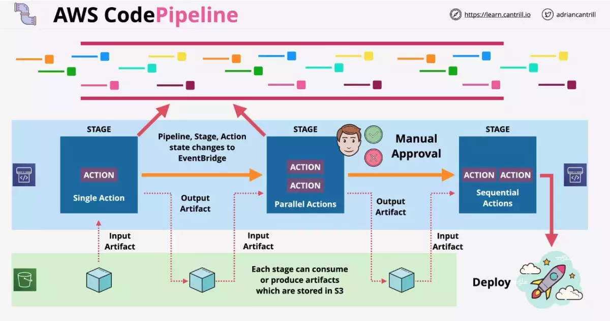
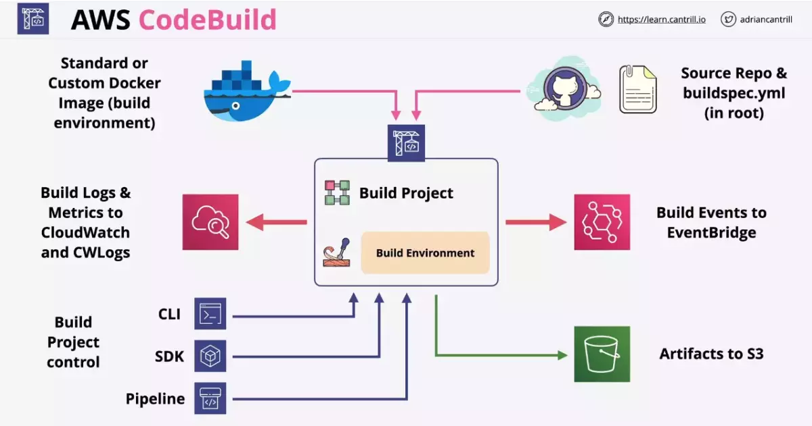

# CodePipeline

- Its a continous delivery tool
- Control the flow from source, through build towards deployment
- Pipelines are build from Stages
- Stages can have sequential or parallel Actions
- Movement between stages can require manual approval
- Actions between stages can consume or generate artifacts (it could be on a S3 bucket linked to the pipeline)
- Stage changes publishes events to the event bridge event bus
- CloudTrail can be used to view or interact with the pipeline



---

# CodeCommit

## Notification

We can set events that trigger notifications like:

Comments

- On commits
- On pull requests

Approvals

- Status changed
- Rule override

Pull request

- Source updated
- Created
- Status changed
- Merged

Branches and tags

- Created
- Deleted
- Updated

Notification for these events can be sent to

- `SNS Topic` or
- `AWS Chatbot (Slack)`.

## Trigger

Just like notification, trigger occurs when something happens on the repo.

But it can:

- Sent to `Amazon SNS` or
- Invoke `AWS Lambda`

## Authorisation and Authentication

Authentication is either using HTTPS Git credentials or SSH key.

Authorisation is using the IAM identity policies, to control what actions are allowed by a user for a certain repo or within CodeCommit.

## Pricing

AWS account gets 5 active users per month for free (within limits), after which you pay $1.00 per additional active user per month.

---

# CodeBuild

CodeBuild compiles your source code, runs unit tests, and produces artifacts that are ready to deploy.


## buildspec.yml

    Uses `buildspec.yml` file.
    Should be at the root of the source.

In this we specify the build phases and then the list of artifacts.

It consists of following phases:

- install (`use this only for core packages, not for dependencies`)
- pre_build (`sign-in or install dependencies`)
- build (`run commands used to build the application`)
- post_build (`package artifacts, push docker image, notifications, etc`)

The **artifacts** section is used to define output location and how it's uploaded to the S3 output bucket.

- This sequence is not required if, for example, you are building and pushing a Docker image to Amazon ECR

You can also define environment variables - shell, variables, parameter-store, secrets-manager



## Integration

`CodeBuild publishes events to CloudWatch` so that we can hook onto different state of the build.

When a build completes, we have an option to save the artifacts to S3 bucket.

Events can be sent to EventBridge

## Considerations

- Alternative to Jenkins
- Uses `docker` for build environment and can be customized
- Integrates with AWS Services such as KMS, IAM, VPC(for networking), CloudTrail(for api auditing) and S3
- Gets source from GitHub, CodeCommit, CodePipeline, S3, etc

## Pricing

Pay only for the resources consumed during the builds.

---

# CodeDeploy

CodeDeploy can deploy your application onto:

- EC2 instances
- AWS Elatic Beanstalk (specify envmt name)
- AWS OpsWorks (specify stack and layer)
- AWS CloudFormation (can be integrated with CF)
- Amazon ECS (Directly or using blue-green deployment model)
- AWS Service Catalog
- Amazon S3

## CodeDeploy agent

For using CodeDeploy on-premises or EC2, we need to use `CodeDeploy agent`.

- The CodeDeploy agent is not required for deployments that target the `serverless lambda servers`.

---

## appspec file

    CodeDeploy uses `appspec.yml` or `appspec.json` file.

This file is used to define `configuration` and `lifecycle event hooks`.

- If you are deploying lambda function to the lambda servers, you can use JSON or YAML file.
- If you are deploying to an EC2 instance or on-prem server, then you must use YAML only.

Configuration section of this file contains:

- files
- resources
- permissions

Lifecycle is controlled through:

- hooks

### Files section

This indicates which files from your application revision should be installed on the instance during the deployment's **Install** event.

- `applies to EC2 and on-premise`

```yaml
files:
  - source: source-file-location-1
    destination: destination-file-location-1
file_exists_behavior: DISALLOW|OVERWRITE|RETAIN
```

### Resources section

- `applies to ECS and Lambda`

The 'resources' section `for an Amazon ECS deployment` contains your Amazon ECS task definition, container and port for routing traffic to your updated Amazon ECS task set, and other optional information.

```yaml
Resources:
  - TargetService:
      Type: AWS::ECS::Service
      Properties:
        TaskDefinition: "task-definition-ARN"
        LoadBalancerInfo:
          ContainerName: "ECS-container-name-for-your-ECS-application"
          ContainerPort: port-used-by-your-ECS-application
        # Optional properties
        PlatformVersion: "ecs-service-platform-version"
        NetworkConfiguration:
          AwsvpcConfiguration:
            Subnets: ["ecs-subnet-1", "ecs-subnet-n"]
            SecurityGroups: ["ecs-security-group-1", "ecs-security-group-n"]
            AssignPublicIp: "ENABLED-or-DISABLED"
        CapacityProviderStrategy:
          - Base: Integer
            CapacityProvider: "capacityProviderA"
            Weight: Integer
          - Base: Integer
            CapacityProvider: "capacityProviderB"
            Weight: Integer
```

The 'resources' section `for an AWS Lambda deployment` contains the name, alias, current version, and target version of a Lambda function.

```yaml
resources:
  - name-of-function-to-deploy:
      type: "AWS::Lambda::Function"
      properties:
        name: name-of-lambda-function-to-deploy
        alias: alias-of-lambda-function-to-deploy
        currentversion: version-of-the-lambda-function-traffic-currently-points-to
        targetversion: version-of-the-lambda-function-to-shift-traffic-to
```

### Permission section

Permission section is used to define permission on the files defined under the files section.

- `applies to EC2 and on-premise`

### Hooks section

The 'hooks' section `for an EC2/On-Premises deployment` contains mappings that link deployment **lifecycle event hooks to one or more scripts**.

The 'hooks' section `for a Lambda or an Amazon ECS deployment` specifies Lambda **validation functions to run during a deployment lifecycle event**.

Following is the list of hooks your scripts or lambda's can run in:

- ApplicationStop
- DownloadBundle
- BeforeInstall
- Install
- AfterInstall
- ApplicationStart
- ValidateService (This is where we validate if the deployment was successful or not)

---

## Considerations

**NOTE**: When we create a CodeDeploy setup

- CodeDeploy requires a service role. Here we give `AWSCodeDeployRole` under the policy.

### Scenario - Health Check

You have set up a deployment group with 10 instances in AWS CodeDeploy, and your minimum healthy instances is at 9. In this scenario, what will AWS CodeDeploy do?

- It deploys the revision to one instance at a time.
- If any of these deployments fail, AWS CodeDeploy immediately fails the overall deployment.

If you had set up a deployment group with 10 EC2 instances in AWS CodeDeploy, and your minimum healthy instances parameter is at 8.

- It deploys the revision to two instances at a time.
- If the revision deployment fails, AWS CodeDeploy immediately fails the overall deployment.

### Scenario - File Conflict

If your AWS CodeDeploy configuration includes creation of a file, nginx.conf, but the file already exists on the server (prior to the use of AWS CodeDeploy), what is the default behavior that will occur during deployment?

- The deployment will fail
- CodeDeploy will not remove files that it does not manage. This is maintained as a list of files on the instance.

### Deletion of custom deployment configuration

What will happen if you delete an unused, custom deployment configuration in AWS CodeDeploy?

- You cannot delete a custom deployment configuration that is still in use.
- You will no longer be able to associate the deleted deployment configuration with new deployments and new deployment groups. `This action cannot be undone`.

### Deletion of application with CodeDeploy

Deleting an application with AWS CodeDeploy removes information about the application from the AWS CodeDeploy system, including all related deployment group information and all related deployment details.

- It does not remove any related application revisions from instances on which the revisions may be installed
- nor does it delete revisions from Amazon S3 buckets where the revisions may be stored.
- It also does not terminate any Amazon EC2 instances or deregister any on-premises instances.
- This action cannot be undone.

---
