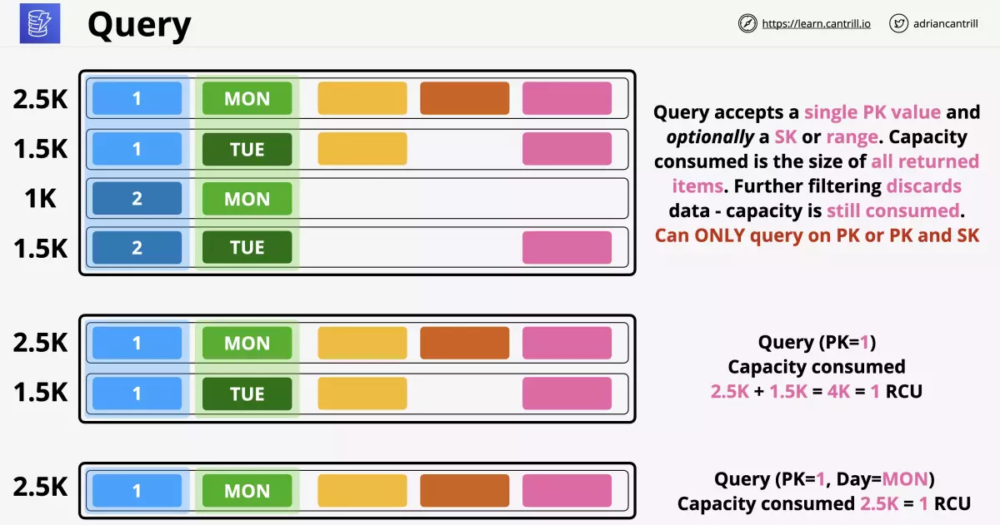
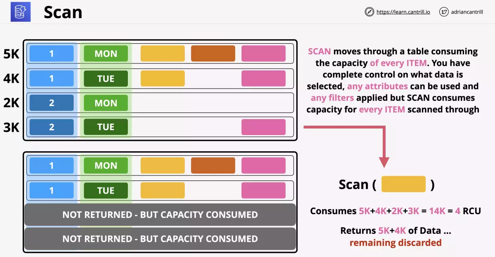
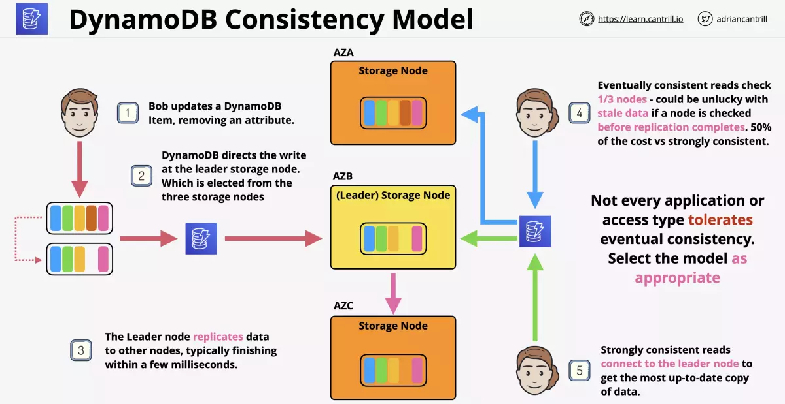
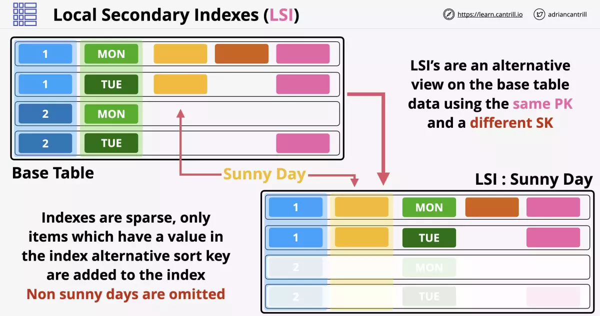

# DynamoDB

## Considerations

NoSQL Public Database as a Service (DBaaS)

Wide column Key/Value database.

Not like RDS which is a Database Server as a Product. This is only the database.

You can take full control and provisioned capacity or use on-demand
mode and set it and forget it.

This is highly resilient, across AZs and optionally globally resilient.

Data is replicated across multiple storage nodes by default so doesn't need to be set up or managed.

Really fast, single digit millisecond access to data (SSD based).

Supports backups and encryption at rest.

It allows event-driven integration. Do things when data changes.

### Dynamo DB Tables

A table is a grouping of items which share the same primary key.
There is no limit to the number of items in a table.

When configuring DynamoDB, you need to pick a primary key from two types

- Simple (Partition)
- Composite (Partition and Sort)

Every item (table row) in the table needs a unique primary key.

Every item (table row) attributes are optional and may or may not have value.

Each item (table row) can be `at most 400KB` in size. This includes the primary key and attributes.

In DynamoDB, capacity means speed.

- If you choose on-demand capacity model you don't have to worry about capacity. You only pay for the operations for the table.
- If you choose provisioned capacity, you must set this on a per table basis.

Capacity is set per WCU or RCU

```
1 WCU means you can write 1KB per second to that table
1 RCU means you can read 4KB per second for that table
```


### Backups

On-demand Backups

- Similar to manual RDS snapshots.
- Full backup of the table that is retained until you manually remove that backup.
- This can be used to restore data in the same region or cross-region.
- You can adjust indexes, or adjust encryption settings.

Point-in-time Recovery

- Must be enabled on each table and is off by default.
- This allows continous record of changes for 35 days to allow you to replay any point in that window to a 1 second granularity.

### Billing

Billing based on:

- RCU and WCU
- Storage on that table
- Additional features on that table

Can purchase reserved capacity with a cheaper rate for a longer term commit.

---

## DynamoDB Operations

### Reading and Writing

On-Demand

- unknown or unpredictable load on a table.
- This is also good for as little admin overhead as possible. Pay a price per million Read or Write units.
- This is as much as 5 times the price as provisioned.

Provisioned

- RCU and WCU set on a per table basis.
- `Every operation consumes at least 1 RCU/WCU`

```
1 RCU = 1 x 4KB read operation per second. (Even 1KB read will consume 1RCU).
1 WCU = 1 x 1KB write operation per second.
```

Every single table has a WCU and RCU burst pool.

- This is 300 seconds of RCU or WCU as set by the table.

### Query

Used to retrive data from DynamoDB.

You have to pick one partition key value to start.

The partition key can be the sensor id, the sort key can be the day of the week you want to look at.

Query can accept:

- Simple primary key (just the partition key)
- Composite primary key (uses both the partition key and sort key)

So using just partition key, which will return more rows, might be better than using partition key with sort key



Also, its recommended to keep the size of the item to the minimum. Since all the operation on dynamodb happens on per item basis, even if you have to retrive a single item billing will depend on the per item size.

Capacity consumed is the size of all returned items. You can use filter to choose particular attributes of the items returned. `Filtering discards data, but capacity is still consumed`.

- so its better to collect more data at once than to filter it using dynamodb

A Query operation can only ever search based on one particular partition key value.

> If you want to search the whole table to get items that meet certain condition, you can't do that with Query.

### Scan

Least efficent when pulling data from Dynamo, but the most flexible.

Scan moves through the table item by item consuming the capacity of every item.

- Even if you return less than the whole table, you will be charged for the entire table.
- It adds up all the values scanned and will charge rounding up.



---

## DynamoDB Consistency

Types of consistency options:

- Eventually Consistent: easier to impliment and scales better
- Strongly Consistent (Immediate): more costly to achieve

NOTE: Eventually consistent reads are charged half the price of Strongly consistent reads

DyanamoDB consists of `storage node` in each availability zone. Following example illustrates a scenario where we have 3 AZs containing one storage node each, having same data.

One storage node is chosen as the `Leader`.

    Strongly consistent reads connect to leader node to get the latest data



In the scenario above Bob updates an attribute of an item. DyanamoDB directs the write at the leader storage node, which is elected from the three storage nodes.

- the leader node replicates the data to other nodes, which usually happens within milliseconds

So, in the above scenario a user reads just before the storage node is updated, user would get the stale data.

### WCU Calculation

Say you need to store 10 items per second with 2.5K average size per item. Calculate WCU.

```
1 KB item = 1 WCU

2.5 KB / 1 KB = 3 KB per item (round up)

3KB per item = 3 WCU

10 items per second = 3 WCU x 10 = 30 WCU
```

### RCU Calculation

Need to retrieve 10 items per second with 2.5K average size per item. Calculate RCU.

```
4 KB item = 1 RCU

2.5 KB / 4 KB = 4 KB per item (round up)

10 items per second = 1 RCU x 10 = 10 WCU

Strongly consistent: 10 RCU
Eventually conssitent: 5 RCU
```

---

## DynamoDB Indexes

Great for improving data retrival in DynamoDB.

Query can only work on 1 partition key value at a time.

Indexes are a way to provide an alternative view on table data.

You have the ability to `choose which attributes are projected`
to the table.

### Local Secondary Indexes (LSI)

Alternative view on base table data. These must be created with a
table in the beginning.

    LSI cannot be added after the table is created.

Maximum of 5 LSI's per base table.

LSI allows `using alternative sort key` on the table but the same partition key.

`Shares the RCU and WCU with the table`, if the main table is using provisioned capacity.

Attributes that can be projected into the LSI has the following options:

- ALL
- KEYS_ONLY
- INCLUDE (lets you choose attributes)

#### Example

As we know scan operation for getting the Sunny Days from the base table is time consuming and costly. We can create LSI during the base table creation instead, using the _sunny day_ attribute as the sort key.



The indexes are sparse. Only items that has value for the attribute used as sort key are included for indexing.
