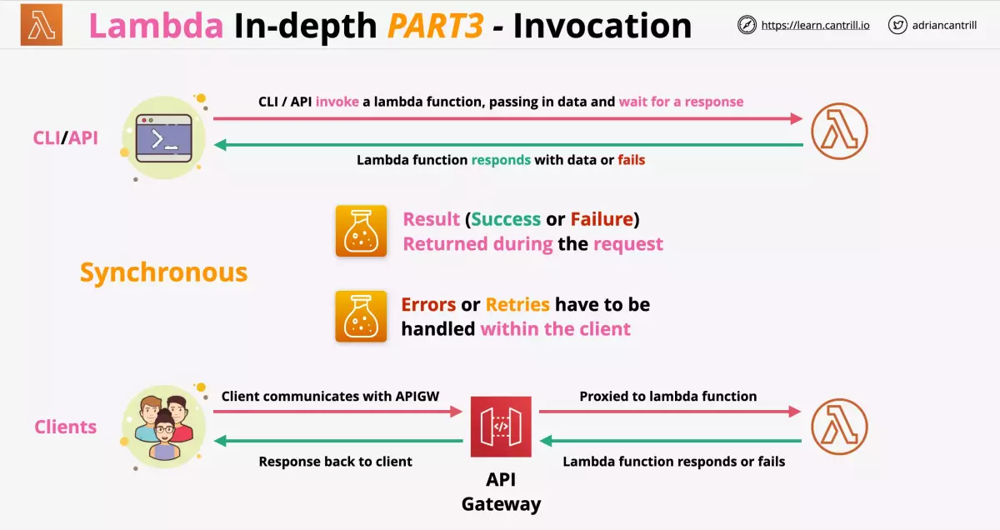
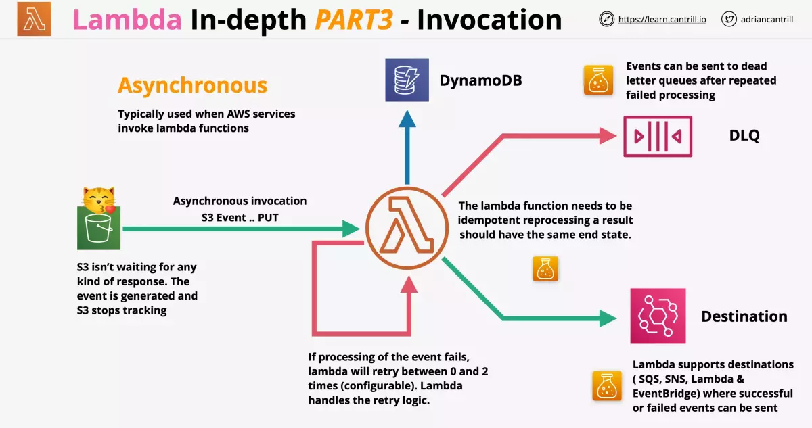
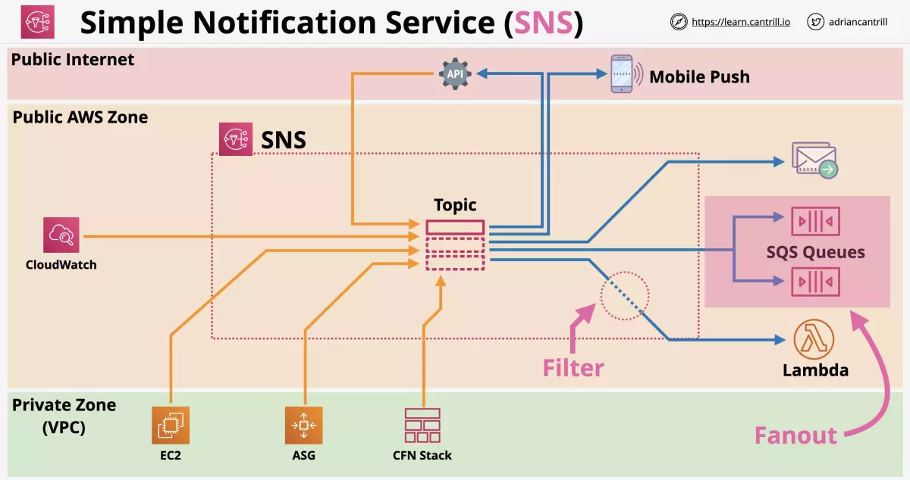
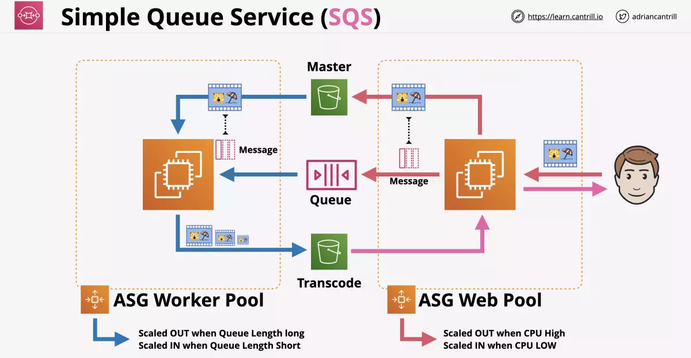
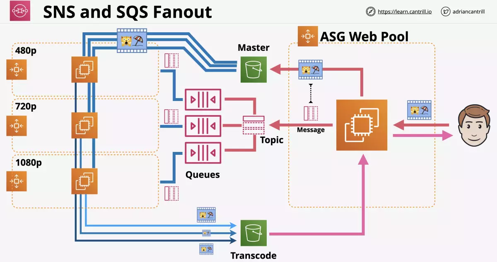
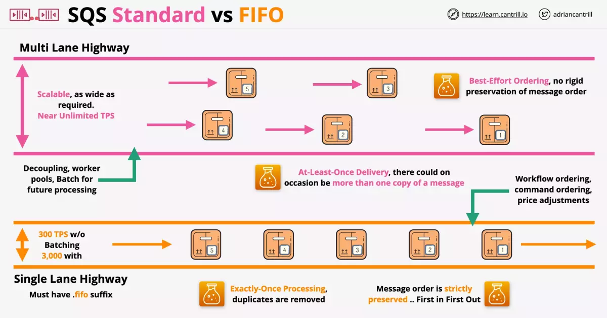
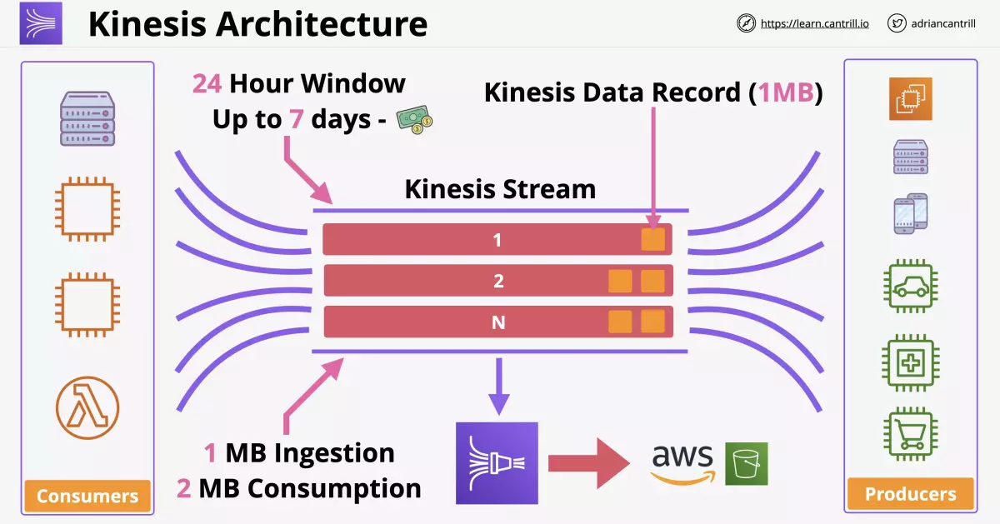

# Architechture Referesher

Monolithic systems even when idle, occupy a lot of resources, so are billed more than needed.

With Tiered application, at least one instance of all the tier should be functional, as each tier is directly connected to each other.

Evolving with Queues, we can have events being placed into a queue for processing irrespective of if processing layer is funtional.

- ASG can look for minimum length of queued items and launch desired number of instances accordingly.

Processing layer can be further broken down using Microservice Architecture.

- Process
- Upload
- Store and Classify

If every component of an application needed a queue between another part of the application, it will be really complex architecture.

- In this case the event driven architecture comes into picture
- Event Router facilitate co-ordination between Event Producer and Event Consumer using Event Bus.
- No constant running or waiting for things
- Producer generate events when something happens
- Events are delivered to consumers of events

Mature event-driven architecture `only consumes resources while handling events (serverless)`.

---

# AWS Lambda

Docker is not supported or is an anti-pattern with Lambda functions.

> Custom runtimes such as `Rust` are possible using `layers`.

While defining a Lambda function you can only define the amount of memory, vCPU is allocated indirectly relative to the memory

- This can be from 128MB to 3GB (64MB steps increment allowed)
- 512 MB storage avaiable as `/tmp`
- 900s (15 minutes) function timeout

An Execution Role is required for Lambda function to work.

    Execution Role is assumed by the Lambda function

    This provides permissions to interact with other AWS services

---

## Use Cases

- Serverless Applications (S3, API Gateway, Lambda)
- File Processing (S3, S3 Events, Lambda)
- Database Triggers (DynamoDB, Streams, Lambda)
- Serverless CRON (EventBridge/CloudWatch Events with Lambda)
- Realtime Stream Data Processing (Kinesis with Lambda)

---

## Public networking

By default, lambda functions are given public networking.

- They can access public AWS services and the public internet.
- But `they cannot access private VPC resources`.
- They can access _public space AWS services such as SQS and DyanamoDB_
- They can access internet based services such as Imdb api.

Lambda running with public networking

    offers best performance because no VPC networking is required

They can access VPC when `public IPs` are provided and `security controls allow external access` to those resources.

---

## Lambda inside VPC

Lambda functions can run inside a VPC and they obey all VPC networking rules.

- Lambda functions running within VPC `can access any resources within the VPC`, if the NACL and Security Groups allow that access.
- But Lambda functions running within VPC `cannot access any external resources outside VPC`, until NACL and Security Groups allow that access.

---

## External access for Lambda inside VPC

You could use a `VPC endpoint such as Gateway Endpoint` to allow access to DynamoDB (public AWS service)

In case the Lambda function within VPC needed access to internet resources

- You can deploy a NAT Gateway in the public subnet
- And then attach a `Internet Gateway` to the VPC

> Lambda inside VPC behaves same as any other VPC service, the same Gateway and Configurations are needed to allow access to AWS public zone and the public internet

Lambda functions need EC2 network permissions via the Execution Role.

- Since the Lambda service needs to create network resources within the VPC, it needs permissions [what permissions?]

---

## Classic Setup for Lambda VPC configuration

Consider the setup on the right, where Lambda in VPC needed access customer VPC.

Each of the Lambda function when invoked, created a ENI in the customer VPC.

- This configuration needed for per function invocation takes time and adds delay
- In addition to this parallel function invocation would require additional ENI posing scaling related challenges

> Earlier it was a bad architecture to use VPC with Lambda

---

## Current Architecture

If all your Lambda used a collection of subnets but the same Security Group, then `only one ENI is required per subnet`.

If all your Lambda used a single subnet and the same Security Group, then `only one ENI is required for all of them`.

With regards to the ENI creation:

- This takes about 90 seconds to create
- But this is done only once when create the lambda function or update the networking configuration

> Now using Lambda with VPC doesnt pose the earlier challenges

---

## AWS Lambda Security

### Execution Role

Consider the below example where the Lambda function is using the pythong runtime environment.

For the runtime environment to access AWS services, the Lambda needs to be provided with an `Execution Role`.

This role is assumed by the Lambda and permission are based on the roles permission policies.

### Resource Policies

Lambda resource policy controls WHAT services and accounts can INVOKE lambda functions.

Resource policy `allows external accounts to access a lambda function` or certain services to use the lambda function such as `SNS and S3`.

You can only change the resource policy using CLI or API [still true?]

---

## Logging

Lambda uses:

- CloudWatch (for metrics: invocation success or failure, retires, latency, etc)
- CloudWatch Logs (logs from exection)
- X-Ray (distributed tracing of session)

for its monitoring and logging.

    CloudWatch Logs require permissions via Execution Role

---

## Versions

Lambda function has version which is a combination of code and configuration of the lambda function.

    Every version of the lambda function is immutable

- Each version is immutable and cannot change once published
- Every lambda function version gets its own ARN (Amazon Resource Name)

`$latest` points to the latest version. (So this is mutable and keeps changing)

`Alias` such as DEV, STAGE, PROD point to a version. (This is mutable and can point to a differnt verion)

---

## AWS Lambda Invocation

Types of invocations

1. Synchronous
2. Asynchronous
3. Event Source Mapping

### Synchronous Invocation

    Used when a user is performing the invocation

Here lambda function is directly invoked via:

- ClI/API or
- Clients communicating with API Gateway

In this type of invocation

- The client waits for the response
- The client needs to handle the errors and retries

---

### Asynchronous Invocation

    Used when an AWS service is performing the invocation

Here is an example where S3 invokes Lambda function, which will perform operations on the object data and then store it in DynamoDB.

- S3 isnt waiting for the Lambda function to complete
- Lambda function will perform retries (re-processing) in case of failures
- Lambda will perform 0 to 2 retries

#### Idempotent

Lambda function needs to be idempotent, so that retries doesn't impact the system in incorrect way.

Consider the example of increasing customer balance by $10.

It can be done using adding $10. With every retry you will increase the customer balance by 10, which is incorrect.

Or setting it directly to a value say $110. This is idempotent.

#### Dead Letter Queue (DLQ)

Events can be sent to dead letter queue after repeated failed processing.

#### Post Processing

Events processed by Lambda, either failed or sucessful, can now be sent to

- SQS
- SNS
- Lambda &
- EventBridge

---

### Event Source Mapping

This is used on streams or queues, `which dont support invocation of lambda`, produced by

- Kinesis
- DynamoDB streams
- SQS

Event Source Mapping `reads/polls` the stream or queue and deliver `event batches` to lambda.

- Event batches either are processed OK or FAIL as a batch

#### Security

Event Source Mapping uses permission from the Lambda Execution Role.

    These permission are required to interact with the event source

#### DLQ

SQL Queues and SNS topics can be used for any discarded failed event batches

---

## EventBridge

**CloudWatch Events** and **EventBridge** have visibility over events generated by supported AWS services within an account.

They both can monitor the `default account event bus` - and `pattern match events flowing through the event bus` and deliver these events to multiple targets (eg. Lambda).

They are also the source of `scheduled events` which `can perform certain actions at certain times` of day, days of the week, or multiple combinations of both - _using the Unix CRON time_ expression format. Action could be call to a target (eg. Lambda).

Both services are one way how event driven architectures can be implemented within AWS.

### Events as json

Events are JSON data that the target can use.

### Recommendation

EventsBridge will replace CW Events.

EventsBridge can also handle events from third parties. Both share the same underlying architecture. AWS is now encouraging a migration to EB.

### Demo

https://learn.cantrill.io/courses/1101194/lectures/29902954

# Simple Notification Service (SNS)

## Architecture

This is a public AWS service which needs access to the public AWS endpoint. This allows anyone from the public internet to access it.

If a VPC is configured to access public AWS endpoints, it can connect to SNS as well.

You can create topics inside the SNS.

- Many different services can publish message into the topic

By default any subscriber will recieve all the messages published on the topic.

- You can put filters on the subscribers to make sure they receive only relevant message of the given topic.

## Considerations

Messages are under 256KB in size. So messages are `not designed for large binary files`.

SNS topics are the base entity of SNS.

- SNS permission are defined on the SNS topic
- SNS configurations are defined on the SNS topic

A publisher sends messages to a topic. Topics have subscribers which recieve messages.

You can use fanout to process different flows from SQS

## Features

SNS Offers:

- Delivery Status including HTTP, Lambda, SQS
- Delivery retries - Reliable Delivery
- High Availability and Scalable (Regional)
- SSE (server side encryption)
- Topics can be used cross-account via Topic Policy (defines what identities have access to that topic)

---

# Simple Queue Service (SQS)

SQS is a public, fully managed, highly-available queues.

Replication happens within a region by default.

Types of queues

- Standard
- FIFO queue

Messages up to 256KB in size. These should link to larger sets of data.

---

## Visibility Timeout

Polling is checking for any messages on the queue. When a client polls and recieves messages, they are hidden due to **visibility timeout**.

    ChangeMessageVisibility changes the value on a per message basis

- visibility timeout is the amount of time that a client can wait to work on the messages.
- If a client recieves messages on the queue and finishes on that workload it can delete the message.
- If the client doesn't delete the message, then it will reappear on the queue.
- A different client can retry processing that message
- Visibility defaults 30 seconds, can be between 0 to 12 hours `on the queue or per message`

---

## Integration

- ASG can scale based on queue length.
- Lambdas can be invoked based on queue length.

---

## SQS Queue with ASG

Here a user uploads a video to a S3 bucket. This creates an event message that is added to the SQS queue.

- ASG Web Pool scales based on High CPU
- ASG Worker Pool scaled based on Queue Length

ASG Worker Pool here is resposible for producing videos of different resolutions and place them into transcode bucket.

---

## SQS Fanout with SNS

Here even though upload of video produces a single event, we use SQS Fanout to send message to multiple SNS queues.

- Different ASG pool is used for each SNS queue

---

## Types of queue

Standard

- multi-lane HW
- doesnt guarantee the order
- at least once delivery
- near unlimited throughput

FIFO

- `need a .fifo suffix` to be a valid FIFO queue
- single lane road with no way to overtake
- guarantee the order
- at exactly once delivery
- throughput of 3,000 messages per second with batching or up to 300 messages second without

### Billing

Billed on **requests** not messages. A request is a single request to SQS

- One request can receive 1 - 10 messages around 256KB in total.
- Requests can return 0 messages.
- The more frequently you poll a SQS Queue, the less effective it is (as it might be returning 0 messages).

---

## Two ways to poll

- short (immediate) : uses 1 request and can return 0 or more messages. If the queue is empty, it will return 0 and try again. This hurts queues that stay short

- long (waitTimeSeconds) : it will wait for up to 20 seconds for messages to arrive on the queue. It will sit and wait if none currently exist.

Messages can live on SQS Queue for up to 15 days. They offer `KMS encryption at rest`.

Access is based on `identity policies` or a `queue policy`.

---

## SQS Extended Client Library

This is used to handle large payloads with SQS & S3.

Specify whether messages are always stored in Amazon S3 or only when the size of a message exceeds 256 KB

- This is especially useful for storing and consuming messages up to 2 GB
- Works like an interface for SQS and S3 integration

### How it works

- SendMessage uploads the message into S3, and store the link in the message
- Receive message loads large payload from S3
- Delete message also deletes large S3 payload

---

## SQS Delay Queues

Delay queues provide an initial period of invisibility for messages. Predefine periods can ensure that `processing of messages doesn't begin until this period has expired`.

    Message timers allow a `per-message` invisibility to be set, overriding any queue setting

- Delay can be between 0 to 15 minutes
- During this period, ReceiveMessage will not retrive these messages
- FIFO queues are not supported

---

## Dead Letter Queue (DLQ)

If a message is processed multiple times but is not being processed, it can be moved to Dead-letter queue.

- When `ReceiveCount > maxReceiveCount`, its moved to DLQ

### redrive policy

Specifies the source queue, the DLQ and the conditions

    Defines `maxReceiveCount`

### Considerations

For example, assume that a message spends 1 day in the original queue before it's moved to a dead-letter queue. If the dead-letter queue's retention period is 4 days, the message is deleted from the dead-letter queue after 3 days

Thus, it is a best practice to always set the retention period of a dead-letter queue to be longer than the retention period of the original queue.

- If the retention period of DLQ is less than source queue, the message will be dropped and not added to DLQ
- Enqueue timestamp is used to indicate when the message was first added to source queue
- The expiration of a message is always based on its original enqueue timestamp. When a message is moved to a dead-letter queue, the enqueue timestamp is unchanged.

---

# SQS vs SNS

SQS is distributed queuing system. Messages are not pushed to receivers. Receivers have to poll SQS to receive messages. Messages can be stored in SQS for short duration of time.

SNS is a distributed publish-subscribe system. _Messages are pushed to subscribers as and when they are sent by publishers to SNS_.

## Key Differences

**Entity Type**

- SQS : Queue (similar to JMS, MSMQ).
- SNS : Topic-Subscriber (Pub/Sub system).

**Message consumption**

- SQS : Pull Mechanism — Consumers poll messages from SQS.
- SNS : Push Mechanism — SNS pushes messages to consumers.

**Persistence**

- SQS : Messages are persisted for some duration is no consumer available. The retention period value is from 1 minute to 14 days. The default is 4 days.
- SNS : No persistence. Whichever consumer is present at the time of message arrival, get the message and the message is deleted. If no consumers available then the message is lost.

In SQS the message delivery is guaranteed but in SNS it is not.

**Consumer Type**

- SQS : All the consumers are supposed to be identical and hence process the messages in exact same way.
- SNS : All the consumers are (supposed to be) processing the messages in different ways.

---

# Step Functions

There are many problems with lambdas limitations that can be solved with
a state machine.

    If time between execution steps is longer than 15 minutes, we use Step Functions

Step functions is a product which lets you build long running serverless workflow based applications within AWS which integrate with many AWS services.

Step functions lets you create state machines (serverless workflow)

- Start
- States
- End

Maximum duration for state machine execution is 1 year. (Eg. online order followed by manual fulfillment of the order will drive the state machine in a long running fashion)

Two types of workflows:

- Standard workflow (standard is the default and has a 1 year workflow)
- Express workflow (for IOT and highly transactional such as IoT and can run for 5 mintues)

Started via

- API Gateway
- IOT Rules
- EventBridge
- Lambda

Amazon States Languate (ASL)

- JSON template (can be used create and export state machines)

These use IAM Roles for permissions.

## States

- Succeed & Fail (will wait until either is achieved)
- Wait (will wait until specific date and time or period of time)
- Choice (different path is determined based on an input)
- Parallel (will create parallel branches based on a choice)
- Map (accepts a list of things)
- Task (Single unit of work - can be integrated with Lambda, Batch, dynamoDB, ECS, SNS, SQS, Step Functions)

---

# Kinesis

## Kinesis Data Stream

This is a scalable streaming service. It is designed to inject data from lots of devices or lots of applications.

- Producers send data into a Kinesis Stream.
- The stream can scale from low to near infinite data rates.
- `Highly available public service by design`.
- Kinesis streams is a `realtime service` (~200 ms)

Streams store a 24-hour moving window of data. `Can be increased to 7 days`. Data that is 24 hours and a second more is replaced by new data entering the stream.

Kinesis `includes the storage` within it for the amount of data that can be ingested during a 24 hour period. However much you ingest during 24 hours, that's included.

Multiple consumers can access data from that moving window.

- One might look at data points once per hour
- Another looks at data in real time.

### Architecture

Kinesis can 1 or many shards

- Each shard can have 1MB/s for ingestion and 2MB/s consumption.
- More the shards more the price
- More the shards more the performance

Data persisted into the Kinesis Stream (24 hour to 7 days) is stored as `Kinesis data records (1MB)`. They are stored accross shards and are the blocks of data for a stream.

**Kinesis data firehose** allows the `long term persistent storage` of kinesis data onto services _like_ S3

## SQS vs Kinesis

SQS has 1 thing sending messages to the queue. One consumer or group of consumer reading from the queue.

If its large number of devices sending data or large throughput requirement, it is likely Kinesis.

SQS allows for async communications where the sender and reciever don't care about what the other is doing. Primarily used for decoupling.

SQS is not built for persistence. Once message is processed, it is deleted.

Kinesis is desiged for huge scale ingestion with multiple consumers. Rolling window for multiple consumers is offered by Kinesis, not by SQS.

Kinesis is designed for data ingestion, analytics, monitoring, app clicks or mobile stream data.

## Kinesis Data Firehose

Kinesis Data Stream doesnt offer to presist data that is injested by producers into Kinesis Data Stream

Kinesis Data Firehose is a fully managed service to load data for data lakes, data stores and analytics services

- supports automatic scaling
- fully serverless
- `near realtime delivery` (~60 seconds)
- supports transformation of data on the fly (Using Lambda)
- billing is based on volume (amount of data passing through the service)

### Architecture

[On the right green box] It can deliver data to:

- HTTP (external service providers)
- Splunk
- Redshift
- ElasticSearch
- Destination Bucket

[The red lines] Data from producers into Kinesis Data Stream can be integrated into Kinesis Data Firehose.

[The purple lines] If you arent using any feature of Kinesis Data Stream, you can send the data directly into Kinesis Data Firehose.

Firehose offers near realtime delivery

    Delivery when buffer size of 1MB fills

    Or Buffer interval in seconds passes

[The pink lines] The data can be sent to `Lambda for transformation` as well as `source records` can be sent to S3 for storage.

[The blue lines] Transformed records can be sent to HTTP, Splunk, Elastic Search or a Destination Bucket.

- While transformed records are being sent to `Redshift`, an intermediate S3 bucket is used
- Redshift copy command is used to pull the data from the bucket into S3

## Kinesis Data Analytics

Kinesis Data Analytics capable of operating in realtime on high throughput streaming data.

- The real time processing is done using SQL
- Ingests from Kinesis Data Streams or Firehose
- Can statically reference data from S3 bucket

Can deliver data to firehose indirectly any destination which firehose support, but the data becomes near realtime.

- S3
- Redshift
- ElasticSearch
- Splunk

It also supports AWS Lambda and Kinesis Data Streams as a destination and the data remains realtime.

- Can perform transformation of data as it passes through using Lambda

### Architecture

Inside the Kinesis Data Analytics application we define inputs and outputs.

The data from Source Stream can use reference data from S3 bucket.

Kinesis Analytics Application uses SQL using Source Stream data with Reference Data as input and produces output stream data.

The output stream data can be sent to either Kinesis Stream or Kinesis Firehose.

- This can be sent to consumers in case of Kinesis Stream (remains realtime data)
- This can be sent to destinations in case on Kinesis Firehose (becomes near realtime data)

### Use Cases

- Streaming data that needs real-time SQL processing
- Time series data
