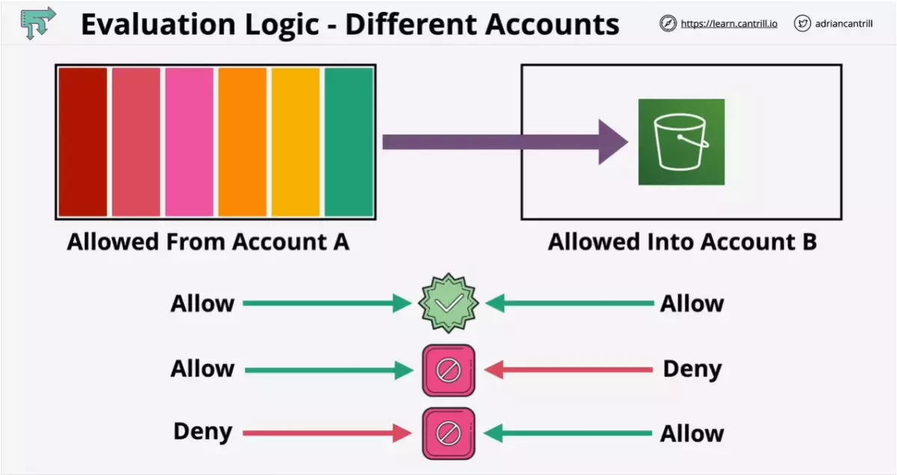

# Implicit deny, explicit deny and explicit allow

Say you have the following permissions on the S3 bucket:

```json
{
  "Version": "2012-10-17",
  "Statement": [
    {
      "Effect": "Allow",
      "Action": [
        "s3:PutObject",
        "s3:PutObjectAcl",
        "s3:GetObject",
        "s3:GetObjectAcl"
      ],
      "Resource": "arn:aws:s3:::holidaygifts/*"
    },
    {
      "Effect": "Deny",
      "Action": ["s3:GetObject", "s3:GetObjectAcl"],
      "Resource": "arn:aws:s3:::holidaygifts/*",
      "Condition": {
        "DateGreaterThan": { "aws:CurrentTime": "2020-12-01T00:00:00Z" },
        "DateLessThan": { "aws:CurrentTime": "2020-12-25T06:00:00Z" }
      }
    }
  ]
}
```

For bucket objects under "arn:aws:s3:::holidaygifts/\*"

- Implicit deny (default rule) denies action `s3:DeleteObject`
- Explicit deny denies actions `s3:GetObject` and `s3:GetObjectAcl` during given time period
- Explicit approve allows actions `s3:PutObject`, `s3:PutObjectAcl`

# NotAction

You generally dont need to specify a policy containing a single statement that has effect "Deny". This is because of the implicit deny.

So the following policy prevents any action against any services which are not in the two supported regions excluding the services "cloudfront, iam, route53 and support"

- Also this needs to be combined with an allow policy, to allow other services in the supported regions.

```json
{
  "Version": "2012-10-17",
  "Statement": [
    {
      "Sid": "DenyNonApprovedRegions",
      "Effect": "Deny",
      "NotAction": ["cloudfront:*", "iam:*", "route53:*", "support:*"],
      "Resource": "*",
      "Condition": {
        "StringNotEquals": {
          "aws:RequestedRegion": ["ap-southeast-2", "eu-west-1"]
        }
      }
    }
  ]
}
```

In the above policy document, instead of `Action` we have `NotAction`.

> "NotAction": ["cloudfront:*", "iam:*", "route53:*", "support:*"]

This is a way of saying deny all the actions that are not part of the `NotAction` list.

Other than that the Condition will evaluate true when the requested region is not (`StringNotEquals`) the in the list:

    "StringNotEquals": {
        "aws:RequestedRegion": ["ap-southeast-2", "eu-west-1"]
    }

# How to secure S3 based home folders and IAM policy variables

```json
{
  "Version": "2012-10-17",
  "Statement": [
    {
      "Effect": "Allow",
      "Action": ["s3:ListAllMyBuckets", "s3:GetBucketLocation"],
      "Resource": "*"
    },
    {
      "Effect": "Allow",
      "Action": "s3:ListBucket",
      "Resource": "arn:aws:s3:::cl-animals4life",
      "Condition": {
        "StringLike": {
          "s3:prefix": ["", "home/", "home/${aws:username}/*"]
        }
      }
    },
    {
      "Effect": "Allow",
      "Action": "s3:*",
      "Resource": [
        "arn:aws:s3:::cl-animals4life/home/${aws:username}",
        "arn:aws:s3:::cl-animals4life/home/${aws:username}/*"
      ]
    }
  ]
}
```

Note that this contains multiple statement and all are of type `Allow`.

NOTE: There is actually not folder in S3 as it follows flat structure. folder are actually are just prefix in S3

NOTE: Certains operations such as s3:ListAllMyBuckets, s3:GetBucketLocation and s3:CreateBucket requires the `"Resource": "*"` to be specified.

Statement 1:

- Allows to list the buckets, but this alone isnt sufficent to look inside the buckets.

Statement 2:

- Allows the list operation on the top level of bucket `cl-animals4life`, home folder and current username folder under home folder

Statement 3:

- Allows all the operations on the S3 bucket `cl-animals4life` folder that are inside the current username folder under home folder and any object within the username folder.

# Permission Evaluation

## Evaluation Flow

When evaluating effective policy permission you have to consider:

- Any AWS Organisation Service Control Policy (SCP)
  - These impact what identities inside the AWS account can do
- Resource Policies
  - There can be policies on the resource being accessed
- IAM Identity Boundries
  - Identities themselves may have boundries
  - So even though Identity Policy may allow certain actions, the Identity boundries may not allow the same.
- Session Policies
  - If you are accessing a resource using an IAM role or you might be accessing a resource using a session which is the subset of what that role allows, then these policies will also be considered.
- Identity Policies


**NOTE**: If given action on the resource is allowed by resouce policy the flow stops.

- And any explicit deny will stop the processing as well.
- Only when a certain policy is missing the flow continues.

## Cross Account

When access is made from Account A to another Account B containing the resource to be accessed:

- If **Account A allows access to resource in Account B** and **Account B allows access to resorce from Account A**, the permission is granted.
- If **Account A allows access to resource in Account B** and **Account B denies access to resource from Account A**, the permission is denied.
- If **Account A denies access to resource from Account B** and **Account B allows access to resource in Account A**, the permission is denied.


