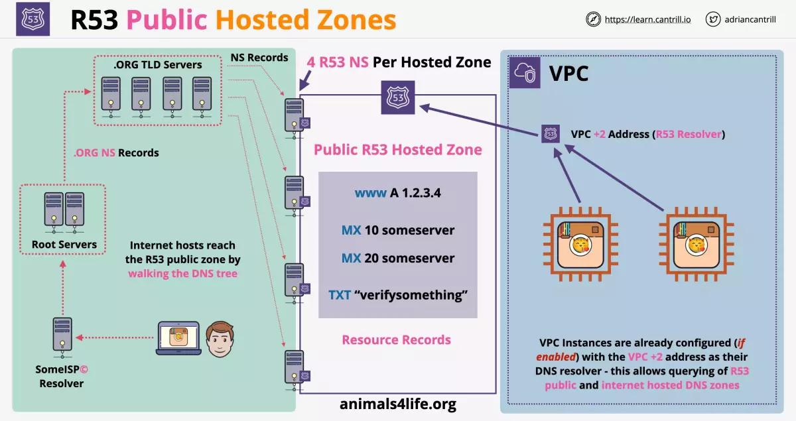

# DNS

https://www.youtube.com/watch?v=JkEYOt08-rU

# Route 53

Route53 consists of private and public hosted zones.

When a domain is registered, TLD holds the NS records. NS records point to Name Servers in the hosted zone. Then the Name Server and the zone they host become authoritative for that domain.

- The zone file is hosted on these Name Servers

## Public Hosted Zones

A Public Hosted Zone is a DNS database (`containing zone files`) for a specific domain, hosted by Route 53 on Public Name Servers.

A Public Hosted Zone can be created for:

- a domain registered with Route53
- a domain registered with other registrars

This is globally resilient service. So whole region can be affected, but Route 53 will still function.

Whenever you create a public hosted zone, Route 53 `creates 4 Public Name Servers`, on which the zone file is hosted.

- These Name Servers are accessible from the public internet and VPCs using Route 53 resolver.
- The zone file is hosted on these Name Servers

### Updating the Name Servers for a domain

To use the public hosted zone with a domain, you change the "NS Records" for the domain and point it to the Public Name Servers created by Route 53.

- This is done by going to the registrar from whom we purchased the website, and making a request to update Name Server records
- Registrar contacts the registry which is responsible for updating the TLD Name Server for that domain

### Resource Records

A public hosted zone of route 53 can contain resource records which contain:

- A record
- AAAA record
- MX record
- TXT record

### Accessing from VPC

The public hosted zone is accessible from within the VPC using the Route 53 resolver, if the DNS is enabled for that VPC.

- Route 53 resolver is on the VPC IP Address (+2)
- VPC instances are already configured (if enabled) with VPC + 2 address as their DNS resolver
- This allows querying of Route 53 public or any internet hosted DNS zones

### Accessing from public DNS

1. Client request to access a domain is received by the DNS resolver of the ISP
2. DNS resolver queries Root Name Servers, which return the information about the TLD Name Server for that domain
3. DNS resolver using this information queries the TLD Name Server of the domain. TLD Name Server records in the TLD point to Name Server, which returns the information about the Authoritative Name Server for that domain..

Since the website's Name Server are in Route 53 Public Hosted zone, these are the Authoritative Name Server for the website.

