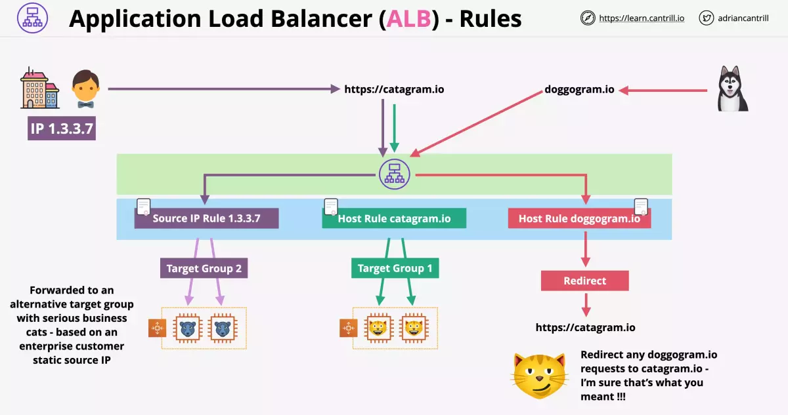
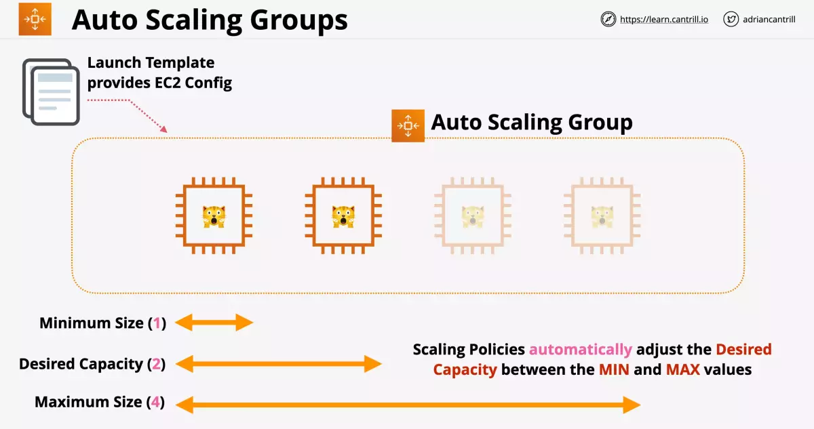

# Regional and Global AWS Architecture

---

# Elastic Load Balancer (ELB)

There are 3 types of ELB available within AWS:

- v1 (Classic Load Balancer - Not Recommended)
- v2 (Application Load Balancer - Recommended)
- v2 (Network Load Balancer - Recommended)

v2 load balancers are faster and `support target groups and rules`.

## Classic Load Balancer

Introduced in 2009. Is not replaced by v2 ELB which is recommended at the moment.

- Classic Load Balancer can load balance between HTTP, HTTPS and other lower level protocols
- Classic Load Balancer is not really layer 7 supporting. It lacks many feature.
- One limitation of Classic Load Balancer is that it only support 1 SSL certificate per load balancer

## Application Load Balancer

Supports layer 7 features. Such as:

- HTTP
- HTTPS
- WebSocket

## Network Load Balancer

Supports:

- TCP
- TLS (Secure form of TCP protocol)
- UDP

In general, this would be used for any application not using HTTP/HTTPS.

---

# Elastic Load Balancer Architecture

Its the job of the load balancer to accept connections from the customer.

- It then distributes these jobs to registered backend compute
- So the infrastructure can scale up or scale down without affecting the customer
- So even if the infrastructure fail and is repaired, user wouldnt be directly affected

Consider the following example where we have a single AWS VPC (region?) with two availability zone A and B. Each of the AZ has one public subnet and few private subnets.

An ELB is placed between these two nodes and which then adds one or more ELB nodes within the subnets that we pick. In our case we have chosen public subnets.

    Each ELB is configured with an A record DNS name.

    This resolves to the ELB nodes.

So any connection made using the DNS name of the ELB are actually made to the nodes of the ELB.

    The DNS name resolves to all of the individual nodes.

Any incoming request is distributed equally among the nodes of the ELB. [How?]

- The nodes are present if different AZ's
- If a node fails, it is replaced
- If the load to ELB increases, more nodes are provisioned inside each of the subnet the ELB is configured to use

## Type of ELB Nodes

The type of ELB node controls the IP addressing of the ELB nodes.

- Internet Facing (given public and private addresses)
- Internal Only (only private addresses)

ELB nodes are `configured with listeners` which `accept traffic on a port and protocol` and `communicate with targets on a port and protocol`.

Once a connection is made to the `Internet Facing ELB node`, it then makes a connection to the instances be it public or private instances.

    ELB requires that the subnet has 8+ free IPs per subnet.

Since 5 IP addresses are reserved by AWS. So we need `/27 or larger subnet` to deploy an ELB which can scale. (/28 also will work in certain scenarios)

    EC2 doesnt need to be public to work with an ELB

## Typical Multi-Tiered Application

Consider the following example of a VPC containing two AZs.

We also have an internet facing ELB. We have an Web Application Scaling Group (ASG), providing frontend capability of the application.

We also have another internal ELB. We have ASG for application instances. These are used by the web servers of the application.

And in the DB subnet, we have aurora instances.

### The Problem

In this case everything is totally dependent on the subsequent layer.

- If the web instance user is connected to scaled or failed, there is an issue.
- If the app instances web layer is connected to scaled or failed, we have a problem.

### The Solution

What we can do is that we can add ELB's between the layers (tiers), to abstract one tier from another.

In this case the user will connect directly to the ELB, which will connect to an application instance.

- So even if a instance fails or scales, user would be unaffected [How? What happens to the current request which was sent to failed instance?]

The web instance will connect to the app instance through an internal ELB. This would abstract away the direct connection between instances of these tiers.

    ELB's allow each tier to scale independently.

    If load on app tier increases, it can scale without affecting any other tier

## Cross-Zone ELB

Note that we use at least one ELB node per AZ. So, in the following example we have a simplified VPC with one ELB in each AZ.

So the user will connect to the DNS name of the application which points to the DNS name of the ELB DNS name.

The DNS name of a ELB will balance load equally between the ELB nodes. [How DNS name can send traffic to any of the ELB node?]

Historically LB nodes could only distribute load within the AZ they are in.

With `Cross-Zone Load Balancing` an ELB node can be distribute load across any of the instance in any AZ.

- This is now enabled by default for an application load balancer.

---

# Load balancing (ALB) vs Network Load Balancing (NLB)

## Comparing Classic LB with v2 LB

## Application Load Balancer

- Layer 7 load balancer
- Listens on HTTP and/or HTTPS
- It cant understand any other Layer 7 protocol (SMTP, SSH, Custom Gaming protocol, etc)
- It cannot be configured to directly listen to TCP/UDP/TLS Listeners

Since its a Layer 7 load balancer, it can understand layer 7:

- content type
- cookies
- custom headers
- user location
- app behaviour

And it can perform `application health check`.

&nbsp;

    HTTP or HTTPS (SSL/TLS) are always terminated on the ALB

A new connection is made from ALB to the origin. Also, `All ALBs must have SSL certs if HTTPS is used`.

> ALBs are slower than NLB since more levels of network stack to be processed.

### ALB Rules

ALB have concept of rules, which direct connections that arrive at a listener.

- Rules are processed in priority order.
- Default rule acts as a catchall rule.

Rules can have conditions which can be used to check:

- host-header
- http-header
- http-request-method
- path-pattern
- query-string
- source-ip

Rules can have actions which can be:

- forward (forward traffic to a target group)
- redirect (can redirect traffic to another domain name)
- fixed-response (respond with a certain success or error code)
- authenticate-oidc (authenticate using open ID)
- authenticate-cognito (authenticate using cognito)

### ALB Rules example

Below is an example of a single ALB is forwarding the request to catagram application based on `host header` (Host Rule).

Same ALB can then forward requests to `alternative target group` that handles enterprise customers based on static source IP (Source IP Rule).

Same ALB can redirect requests coming from _doggogram.io_ to `https://catagram.io`.

---

## Network Load Balancers

- Layer 4 load balancer
- Can work with TCP, TLS, UDP and TCP_UDP (TCP with UDP)
- Doesnt have any understand of HTTP and HTTPS
- They cant see headers, or cookies, or understand session
- Are very very fast (millions of rps, 25% of ALB latency)
- Ideal for apps that use SMTP, SSH, Custom Game protocols, financial apps not using HTTPS

Health check with NLB

- Checks only ICMP/TCP handshake
- Not app aware

Also,

    NLB's can have static IPs, so can be whitelisted

Can Forward TCP to instances.

    Which mean unbroken encryption between client and origin.
    No termination on the ELB.

---

## How to choose

Use Network Load Balancer if:

- your application requires unbroken encryption
- static IP for whitelisting
- the fastest performance (million rps, 4 times of ALB)
- the protocol is not HTTP or HTTPS
- privatelink

Else choose Application Load Balancer

---

# Launch Configuration and Templates

LC and LT lets you define anything that you define while launching a EC2 instance such as

- AMI, Instance Type, Storage, Key Pair
- Networking and Security Groups
- Userdata and IAM Role

> Launch Configuration and Templates are not editable

Launch Configuration

    used with Auto Scaling Groups

- doesnt support versions as well

Launch templates

    used with Auto Scaling Groups

    used also to launch EC2 instance directly from console or CLI

- Newer and recommended to use over launch configurations, they include the latest features and improvements.
- Provide T2/T3 Unlimited, placement groups with more.
- Supports versioning of templates.
- Can be used to save time when provisioning EC2 instances from the console UI / CLI.

> If you need to adjust a configuration, you must make a new one and launch it.

---

# Auto Scaling Groups (ASG)

ASG is used with ELB and Launch Templates to deliver elatic architectures.

- ASG does automatic scaling and self-healing for EC2.

Key properties defined for an ASG are:

- Minimum
- Desired
- Maximum

Role of an ASG is to keep the number of instances at Desired capacity by provisioning or terminating instances.

## Example

ASG is under a VPC and runs across one or more subnets.

It uses either a Launch Template (selected version) or Launch Configuration.

You can manually set the values for the ASG and it will set the number of instances using LT or LC.

## Ways to adjust values of ASG

1. Manual Scaling - Manually adjust the desired capacity.
2. Scheduled Scaling - Based on schedule. Eg. sales, off hours.
3. Dynamic Scaling
   - Simple Scaling can be used to automate scaling based on metrics such as:
     - CPU Load
     - Memory
   - Stepped Scaling can be used to add or remove incrementally
   - Target Tracking can be used to scale using aggregate CPU, network, `request count per target`, etc
4. Cooldown Periods is used to wait between scaling actions (Since there is minimum billing period after an instance is provisioned)

## Health Checks
