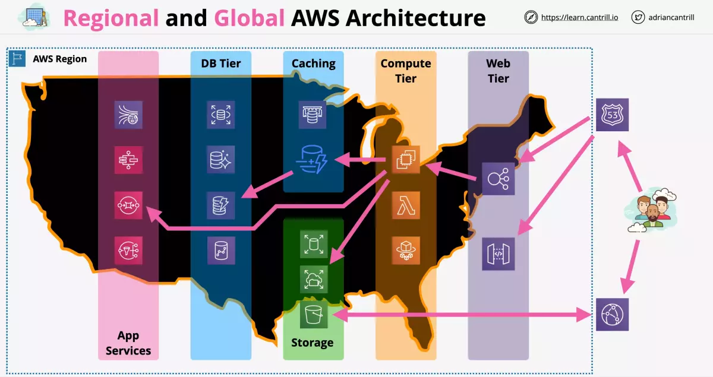
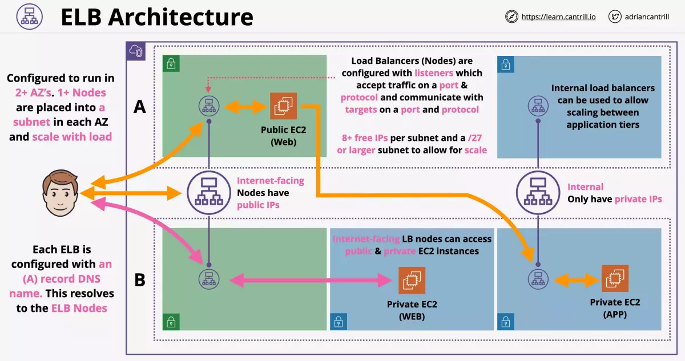

# Scaling, Load Balancing & High-Availability

## Regional and Global AWS Architecture

---

## Elastic Load Balancer (ELB)

There are 3 types of ELB available within AWS:

- v1 (Classic Load Balancer - Not Recommended)
- v2 (Application Load Balancer - Recommended)
- v2 (Network Load Balancer - Recommended)

v2 load balancers are faster and `support target groups and rules`.

### Classic Load Balancer

Introduced in 2009. Is not replaced by v2 ELB which is recommended at the moment.

- Classic Load Balancer can load balance between HTTP, HTTPS and other lower level protocols
- Classic Load Balancer is not really layer 7 supporting. It lacks many feature.
- One limitation of Classic Load Balancer is that it only support 1 SSL certificate per load balancer

### Applicatoin Load Balancer

Supports layer 7 features. Such as:

- HTTP
- HTTPS
- WebSocket

### Network Load Balancer

Supports:

- TCP
- TLS (Secure form of TCP protocol)
- UDP

In general, this would be used for any application not using HTTP/HTTPS.

---

## Elastic Load Balancer Architecture

Its the job of the load balancer to accept connections from the customer.

- It then distributes these jobs to registered backend compute
- So the infrastructure can scale up or scale down without affecting the customer
- So even if the infrastructure fail and is repaired, user wouldnt be directly affected

Consider the following example where we have a single AWS region with two availability zone A and B. Each of the AZ has one public subnet and few private subnets.

An ELB is placed between these two nodes and which then adds one or more ELB nodes within the subnets that we pick. In our case we have chosen public subnets.

    Each ELB is configured with an A record DNS name.

    This resolves to the ELB nodes.

So any connection made using the DNS name of the ELB are actually made to the nodes of the ELB.

    The DNS name resolves to all of the individual nodes.

Any incoming request is distributed equally among the nodes of the ELB. [How?]

- The nodes are present if different AZ's
- If a node fails, it is replaced
- If the load to ELB increases, more nodes are provisioned inside each of the subnet the ELB is configured to use

### Type of ELB Nodes

The type of ELB node controls the IP addressing of the ELB nodes.

- Internet Facing (given public and private addresses)
- Internal Only (only private addresses)

ELB nodes are `configured with listeners` which `accept traffic on a port and protocol` and `communicate with targets on a port and protocol`.

Once a connection is made to the `Internet Facing ELB node`, it then makes a connection to the instances be it public or private instances.

    ELB requires that the subnet has 8+ free IPs per subnet.

Since 5 IP addresses are reserved by AWS. So we need `/27 or larger subnet` to deploy an ELB which can scale. (/28 also will work in certain scenarios)
