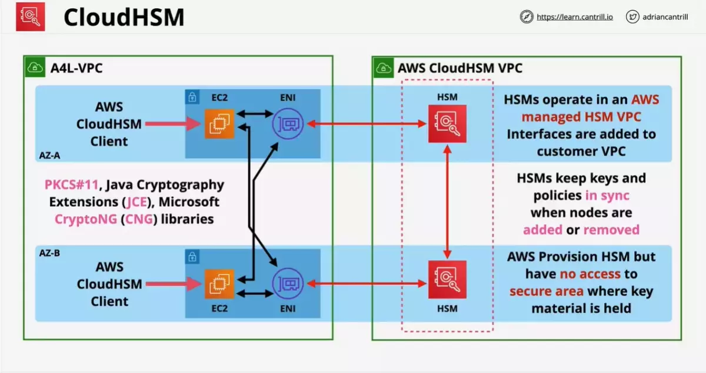

# Cloud HSM

# EC2 plus

### AWS::CloudFormation::Init

**cfn-init** is a helper script installed on EC2 OS.

This is a simple configuration management system.

Procedural (user Data) vs Desired State (cfn-init)

Packages, groups, users, sources, files, commands, services, and ownerships.

This is executed as any other command by passing into the instance with
the user-data.

This is provided with directives via Metadata and AWS::CloudFormation::Init on
a CFN resource

#### cfn-init explained

Starts off with a **cloud formation template**
This has a logical resource within it which is to create an EC2 instance.

This has a specific section called `Metadata:`

This then passes in the information passed in as `UserData`

cfn-init gets variables passed into the userdata by cloud formation

It knows the desired state desired by the user and can work towards a
final stated configuration

This can monitor the userdata and change things as the EC2 data changes.

#### CreationPolicy and Signals

The template has a specific part designated signals

A creation policy is added to a logical resource. It is provided a
timeout value. The resource itself will trigger a signal that cloud formation
can continue

# VPC Peering

Instances in either VPC can communicate with each other as if they are within the same network.

The VPCs can be in different regions (also known as an inter-region VPC peering connection).

This is neither a gateway nor a VPN connection, and does not rely on a separate piece of physical hardware.

## use case

A VPC peering connection helps you to facilitate the transfer of data. For example, if you have more than one AWS account, you can peer the VPCs across those accounts to create a file sharing network. You can also use a VPC peering connection to allow other VPCs to access resources you have in one of your VPCs.

- In case of cross account peering connection, one account creates the peering connection request and other approves the same

# VPC

Can a VPC span across regions?

# AWS Direct Connect

Direct Connect provides Amazon Web Services (AWS) customers with a way to transfer data that does not involve using the public Internet.

Say your company uses multiple Amazon VPCs and is setting up a new office.

- Establish a private connection from your new office’s network to your Amazon VPC using AWS Direct Connect
- This option provides predictable network performance, reduces bandwidth costs, and doesn’t require that customers be responsible for implementing high availability solutions for all VPN endpoints.
- The downside of this option (possible requiring additional telecom and hosting provider relationships) is mitigated in this instance because the office is new and would need to provision a whole new network anyway.

AWS Direct Connect uses dedicated, private network connections between your intranet and Amazon VPC. Use AWS Direct connect:

- If you have an immediate need, have low to modest bandwidth requirements, and can tolerate the inherent variability in Internet-based connectivity.
- A VPC VPN Connection utilizes IPSec to establish encrypted network connectivity between your intranet and Amazon VPC over the Internet.

## Scenario

You are managing your company's data and preparing for a migration to an AWS cloud environment. One of the first steps you are doing is uploading data to Amazon S3 buckets. You are uploading large amounts of data overnight, 3 to 5 TB to an S3 bucket. What steps can you take to decrease the amount of time to perform these uploads?

Using AWS Direct Connect, data that would have previously been transported over the Internet can now be delivered through a private network connection between AWS and your datacenter or corporate network. In many circumstances, private network connections can reduce costs, increase bandwidth, and provide a more consistent network experience than Internet-based connections.
